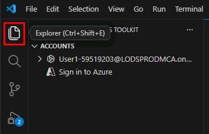
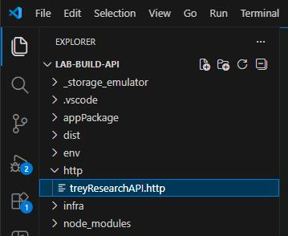
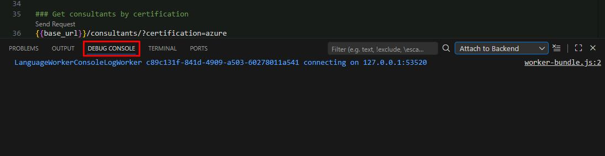
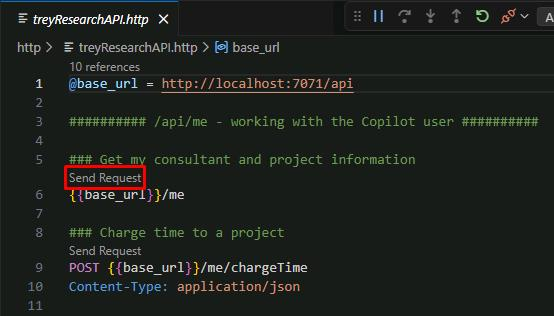
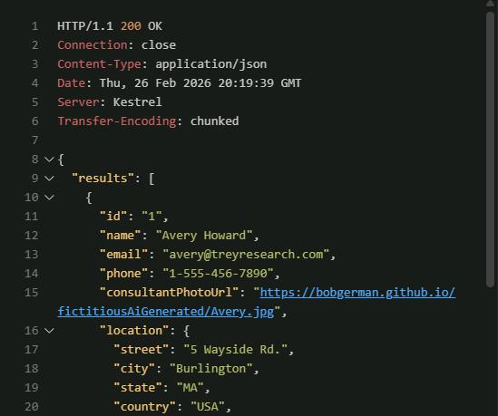

## Task 02: Test the app's web services

### Description

You'll use the `.http` test file included in the project to send requests directly to the running API, exploring the available endpoints and verifying their responses.

### Success criteria

- You sent a GET request to `/api/me` and received a JSON response for the fictitious user Avery Howard.
- You charged 3 hours to the Woodgrove Bank project and confirmed the updated `deliveredThisMonth` value in a follow-up `/api/me` request.
- You sent additional GET requests to explore consultant data by skill, role, and availability.
- You stopped the debugger and closed the open files.

{: .note }
> The Trey Research project is an API plugin, so it includes an API. In this task, you'll test the API manually to understand what it does before connecting it to an agent.

### Key steps

---

#### 01: Get the **/me** resource

1. In VS Code's leftmost pane, select the **Explorer** icon.

    

1. In the **EXPLORER** pane, expand the **http** folder, then select **treyResearchAPI.http**.

    

1. In the bottom pane, select the **DEBUG CONSOLE** tab.

    

    {: .note } **Attach to Backend** is selected by default.

1. In the **treyResearchAPI.http** file, select **Send Request** below line 5, for **{{base_url}}/me**.

	

    {: .note } You'll see a response in the right pane, with a log of the request in the bottom pane. The response shows the information about the logged-in user, but since we haven't implemented authentication yet, the app will return information on the fictitious consultant Avery Howard. 
    
1. Observe the response to see details about Avery, including a list of project assignments.

    