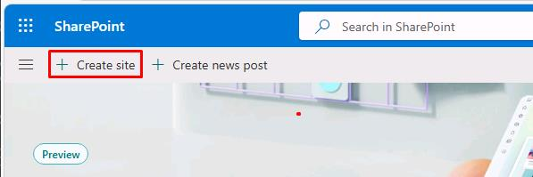
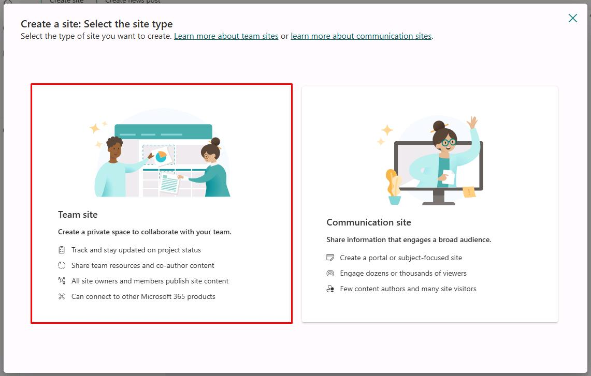
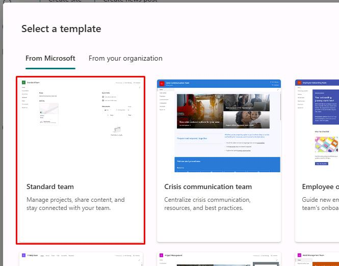
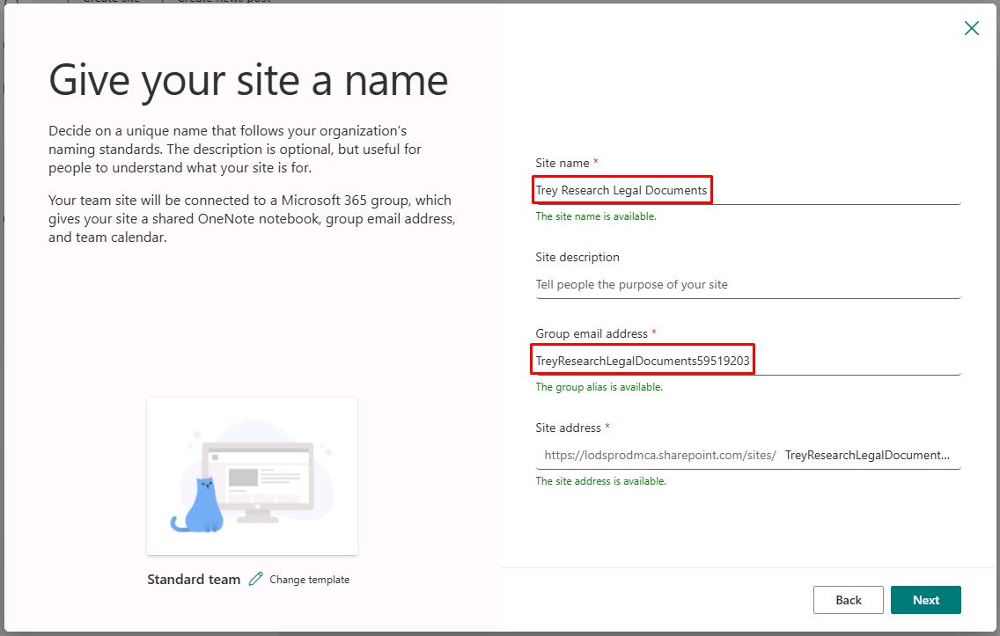
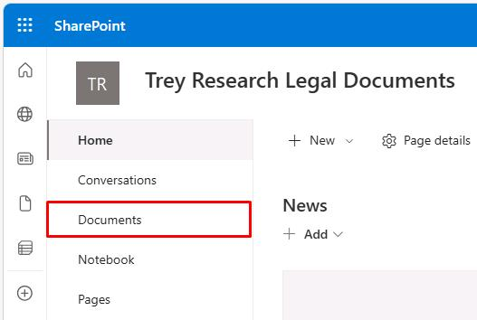
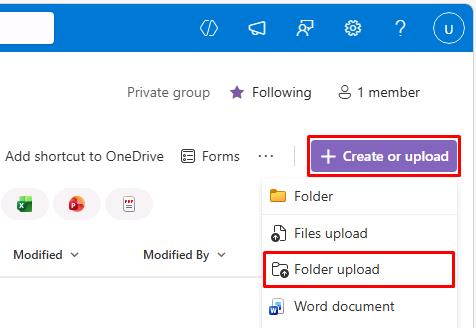
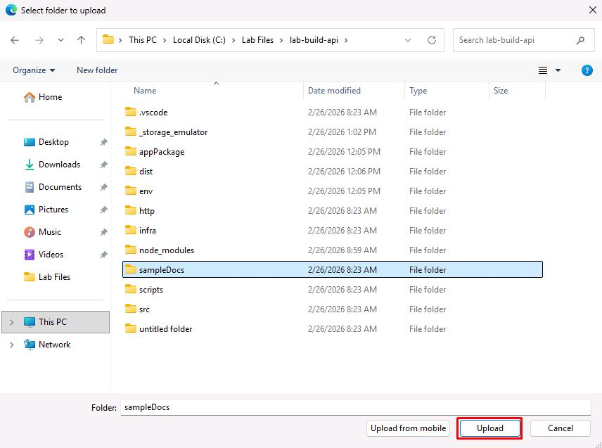
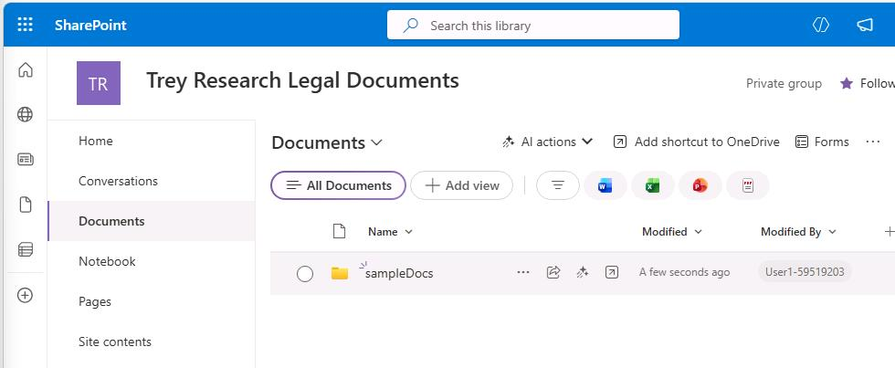

## Task 01: Upload sample documents

### Description

You'll create a new SharePoint Team site and upload the sample consulting documents included in the project. The declarative agent will use these documents as grounding knowledge when answering prompts.

### Success criteria

- You created a SharePoint Team site named `Trey Research Legal Documents` with the correct group email address and site address suffix.
- You uploaded the `sampleDocs` folder from `C:\Lab Files\lab-build-api` to the site's **Documents** library.

### Key steps

---

#### 01: Create a SharePoint site

1. Open Microsoft Edge, then go to `lodsprodmca.sharepoint.com/_layouts/15/sharepoint.aspx`.

1. Sign in with your lab credentials:

    | Item | Value |
    | ---- | ----- |
    | Username | `@lab.CloudPortalCredential(User1).Username` |
    | Temporary Access Pass (TAP) | `@lab.CloudPortalCredential(User1).AccessToken` |

1. On the top bar, select **Create site**.

    

1. In the dialog, select **Team site**.

    

1. Select **Standard team**.

    

1. In the lower-right corner of the dialog, select **Use template**.

1. In the **Give your site a name** dialog, enter the following:

    | Item | Value |
    | ---- | ----- |
    | Site name | `Trey Research Legal Documents` |
    | Group email address | `TreyResearchLegalDocuments@lab.LabInstance.Id` |
    | Site address suffix | **TreyResearchLegalDocuments@lab.LabInstance.Id** |

    

	{: .warning }
    > Use the provided values, as these will be referenced again in future steps. The numbers shown in the screenshot will not match your instance. 

1. In the lower-right corner of the dialog, select **Next**.

1. Select **Create site**.

1. Once the site is created, select **Finish**.

#### 02: Upload the sample documents

1. In the site menu, select **Documents**.

    

1. Near the upper-right corner of the page, select **Create or upload**, then select **Folder upload**.

    

1. Go to `C:\Lab Files\lab-build-api`, select the **sampleDocs** folder, then select **Upload**.

    

1. In the dialog, select **Upload**.

    
