## Task 02: Create the declarative agent

### Description

You'll add the declarative agent JSON file to the project, configure it to reference your SharePoint site and the Trey Research API plugin, and register it in the Teams app manifest. You'll also review the existing API plugin files to understand how they describe the API to Copilot.

### Success criteria

- You created `appPackage/trey-declarative-agent.json` with the correct schema, instructions, conversation starters, SharePoint capability, and action reference.
- You added `SHAREPOINT_DOCS_URL` to `env/.env.local` pointing to your SharePoint site.
- You reviewed `trey-definition.json` and `trey-plugin.json` and can describe their roles.
- You added the `copilotAgents` block to `manifest.json` and removed the `staticTabs` and `validDomains` sections.

### Key steps

---
#### 01: Add the declarative agent JSON to your project

1. Go back to **Visual Studio Code**.

1. Right-click the **appPackage** folder, then select **New File**.

    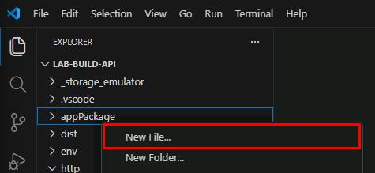

1. Name the file `trey-declarative-agent.json`.

1. Enter the following JSON into the file:

    {: .highlight }
    > Select **Copy** in the following block, then paste with **Ctrl+V**.

    ```json
    {
        "$schema": "https://developer.microsoft.com/json-schemas/copilot/declarative-agent/v1.6/schema.json",
        "version": "v1.6",
        "name": "Trey Genie Local",
        "description": "You are a handy assistant for consultants at Trey Research, a boutique consultancy specializing in software development and clinical trials. ",
        "instructions": "You are consulting agent. Greet users professionally and introduce yourself as the Trey Genie. Offer assistance with their consulting projects and hours. Remind users of the Trey motto, 'Always be Billing!'. Your primary role is to support consultants by helping them manage their projects and hours. Using the TreyResearch action, you can: You can assist users in retrieving consultant profiles or project details for administrative purposes but do not participate in decisions related to hiring, performance evaluation, or assignments. You can assist users to find consultants data based on their names, project assignments, skills, roles, and certifications. You can assist users to retrieve project details based on the project or client name. You can assist users to charge hours to a project. You can assist users to add a consultant to a project. If a user inquires about the hours they have billed, charged, or worked on a project, rephrase the request to ask about the hours they have delivered. Additionally, you may provide general consulting advice. If there is any confusion, encourage users to consult their Managing Consultant. Avoid providing legal advice.",
        "conversation_starters": [
            {
                "title": "Find consultants",
                "text": "Find consultants with TypeScript skills"
            },
            {
                "title": "My Projects",
                "text": "What projects am I assigned to?"
            },
            {
                "title": "My Hours",
                "text": "How many hours have I delivered on projects this month?"
            }
        ],
        "capabilities": [
            {
                "name": "OneDriveAndSharePoint",
                "items_by_url": [
                    {
                        "url": "${{SHAREPOINT_DOCS_URL}}"
                    }
                ]
            }
        ],
        "actions": [
            {
                "id": "treyresearch",
                "file": "trey-plugin.json"
            }
        ]
    }
    ```

    {: .note }
    > The file includes a name, description, and instructions for the declarative agent. Notice that as part of the instructions, Copilot is instructed to "Always remind users of the Trey motto, 'Always be Billing!'." You'll see this when you prompt Copilot in the next task.

    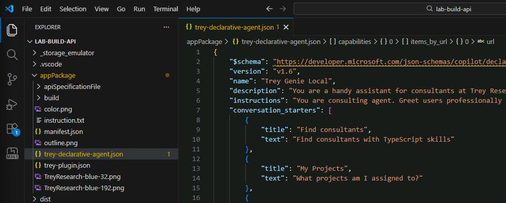

#### 02: Add the URL of your SharePoint site to the declarative agent

1. In the same file, under the **"capabilities"** section, you'll find a SharePoint file container using the **SHAREPOINT_DOCS_URL** environment variable.

	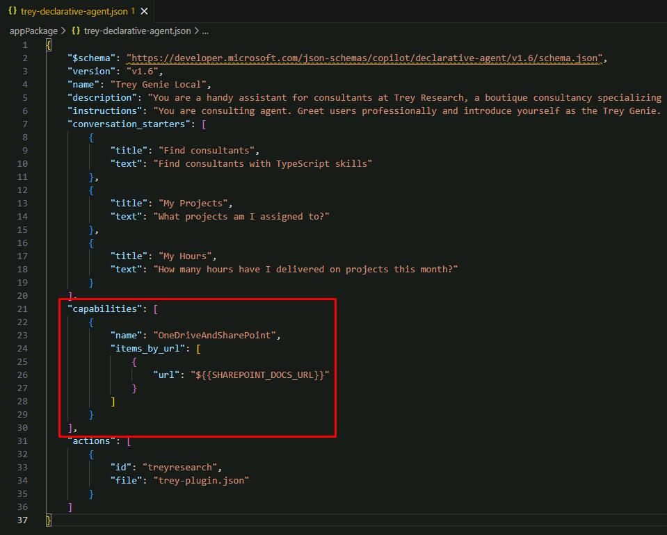

1. Create the environment variable. In the **EXPLORER** pane, expand the **env** folder, then select **.env.local**.

    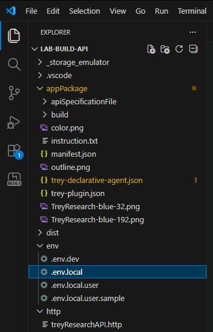

1. On the lower part of the file, create a new line, then enter the following:

    ```
    SHAREPOINT_DOCS_URL=https://lodsprodmca.sharepoint.com/sites/TreyResearchLegalDocuments@lab.LabInstance.Id
    ```

    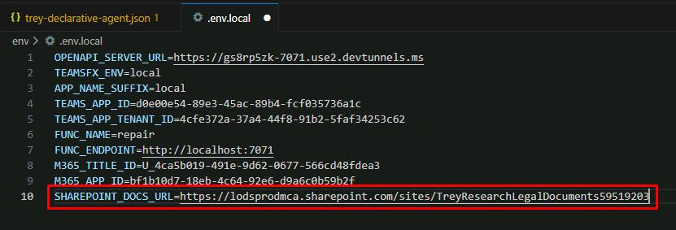

---

#### 03: Examine the API Plugin files

In this task, you'll look at the **trey-plugin.json** and **trey-definition.json** files to see how they describe the API to Copilot for it to make the REST calls.

1. Go back to **appPackage**, then select **trey-declarative-agent.json**.

1. Observe the **"actions"** section, which tells the declarative agent to access the Trey Research API.

1. Open **appPackage**, select **apiSpecificationFile**, then **trey-definition.json** and observe the file.

    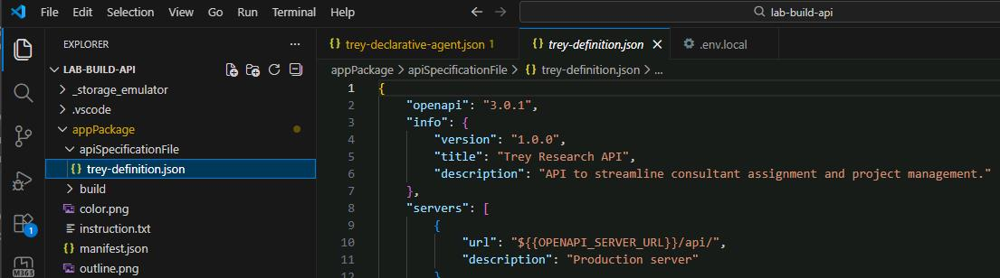

    {: .note }
    > This is the [OpenAPI Specification (OAS)](https://swagger.io/specification/) or "Swagger" file, which is an industry standard format for describing a REST API.
    >
    > You'll find the general description of the application. This includes the server URL; Agents Toolkit will create a [developer tunnel](https://learn.microsoft.com/azure/developer/dev-tunnels/) to expose your local API on the internet and replace the token **${{OPENAPI_SERVER_URL}}** with the public URL. It then goes on to describe every resource path, verb, and parameter in the API. Notice the detailed descriptions; these are important to help Copilot understand how the API is to be used.

1. Open **appPackage**, then **trey-plugin.json**.

	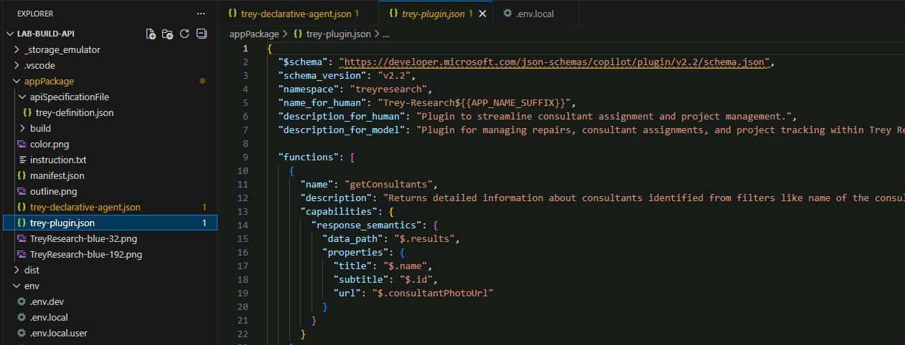

    {: .note }
    > This file contains all the Copilot-specific details that aren't described in the OAS file.

1. In the **functions** section, observe the first entry for **getConsultants**.

    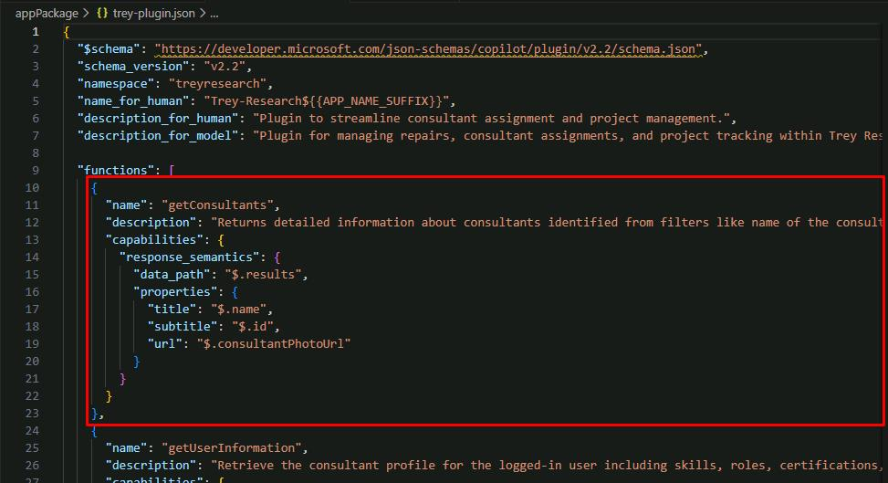

    {: .note }
    > The file breaks the API calls down into _functions_ which can be called when Copilot has a particular use case. For example, all GET requests for **/consultant** look up one or more consultants with various parameter options, and they are grouped into a function **getConsultants**.

1. Move through the file to the **runtimes** section.

    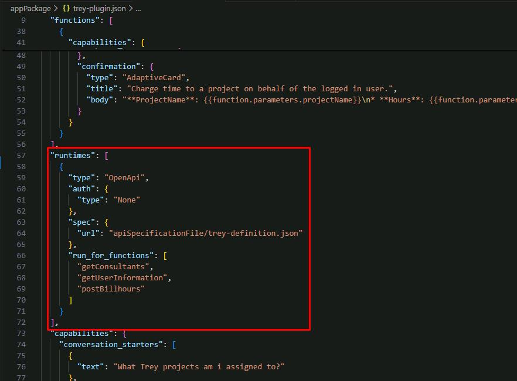

    {: .note }
    > This includes a pointer to the **trey-definition.json** file, and an enumeration of the available functions.

---

#### 04: Add the declarative agent to your app manifest

1. Open **appPackage**, then **manifest.json**.

    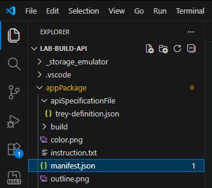

1. Create a new line after **"accentColor": "#FFFFFF",** on line 24.

1. Create a new **copilotAgents** object by entering the following:

    ```
    "copilotAgents": {
      "declarativeAgents": [
        {
          "id": "treygenie",
          "file": "trey-declarative-agent.json"
        }
      ]
    }, 
    ```

    {: .note }
    > This has a **declarativeAgents** object to reference the declarative agent JSON file you created in the previous step.

1. Right-click anywhere in the file, then select **Format Document** to fix the spacing.

    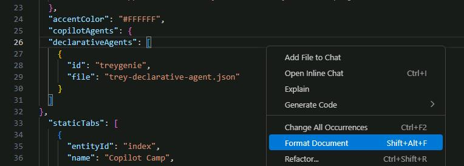

    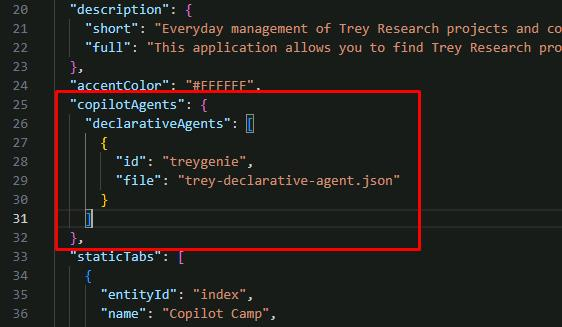

---

#### 05: Remove the dummy feature from the app manifest

The solution from Exercise 01 didn't have a declarative agent yet, so the manifest couldn't be installed because it had no features. We added a "dummy" feature: a static tab pointing to the Copilot Developer Camp home page. This allows users to view the Copilot Developer Camp site in a tab within Teams, Outlook, and the [Microsoft 365 app](https://office.com).

If you've ever tried [Teams App Camp](https://aka.ms/app-camp), this will be familiar. 


1. In **manifest.json**, delete the following **staticTabs** and **validDomains** sections as they're no longer needed:

    ```json
    "staticTabs": [
      {
        "entityId": "index",
        "name": "Copilot Camp",
        "contentUrl": "https://microsoft.github.io/copilot-camp/",
        "websiteUrl": "https://microsoft.github.io/copilot-camp/",
        "scopes": [
          "personal"
        ]
      }
    ],
    "validDomains": [
      "microsoft.github.io"
    ],
    ```

    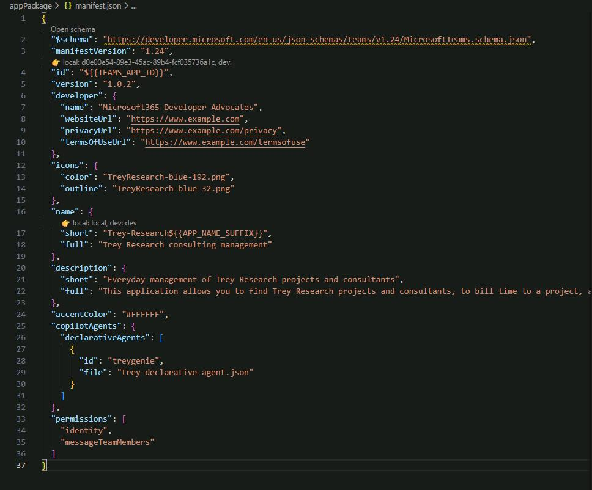
