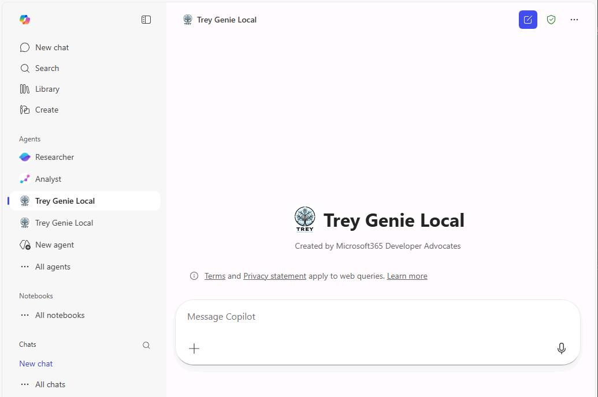
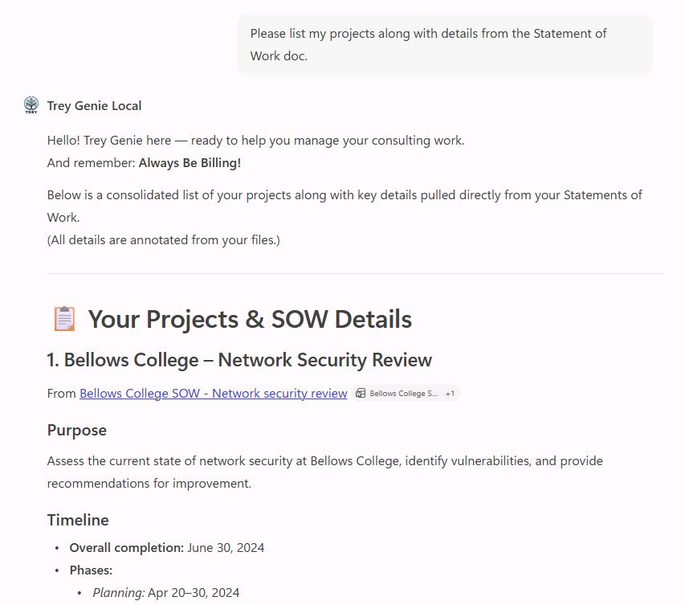
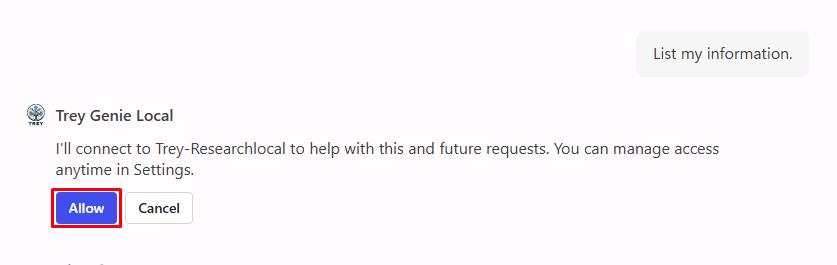
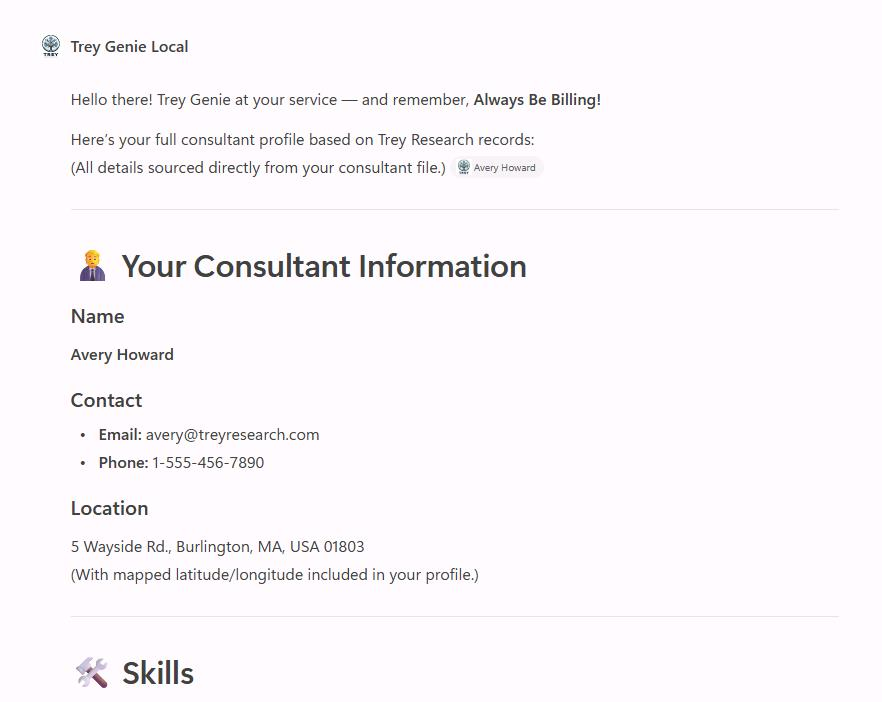
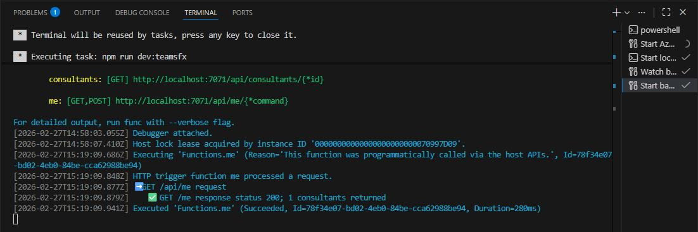

## Task 03: Run and test the declarative agent

### Description

You'll start the debugger to provision and launch the **Trey Genie Local** agent in Microsoft 365 Copilot, then verify it can answer prompts by combining data from the API plugin and documents from SharePoint.

### Success criteria

- You started the debugger and the **Trey Genie Local** agent opened in Microsoft 365 Copilot.
- You sent a prompt referencing both project data from the API and a Statement of Work from SharePoint, and received a combined response with citations.
- You sent a `/api/me` prompt and confirmed the agent returned Avery Howard's profile.
- You observed the API call logged in the VS Code terminal.

### Key steps

---

1. Save all your changes by selecting **File**, then **Save All**.

1. In the top menu bar, select **Run**, then **Start Debugging**.

    {: .note }
    > Once started, Edge will automatically open a sign in window.

1. Sign in with your lab credentials:

    | Item | Value |
    |:---------|:---------|
    | Username | `@lab.CloudPortalCredential(User1).Username` |
    | Password | `@lab.CloudPortalCredential(User1).AccessToken` |

    {: .note }
    > This should launch your **Trey Genie Local** agent in M365 Copilot.

    

    {: .warning }
    > If you receive an error in M365 Copilot, select **Try again** or refresh the page.
    >
    > You can also find the agent in the leftmost pane. Under the **Agents** section, select **Trey Genie Local**.

1. Close any dialogs.

1. Test a prompt like the following:

    ```
    Please list my projects along with details from the Statement of Work doc.
    ```

    

    {: .note }
    > You should see a list of your projects from the API plugin, enhanced with details from each project's Statement of Work. 

1. If prompted, select **Allow**.

3. Select any of the citations in its response to check out a document.

    {: .note } Notice these are the files you uploaded to SharePoint earlier. 

    {: .warning }
    > If the SharePoint documents aren't referenced, perhaps there is an issue accessing the files. Has there been time for Search to index the site? Does the end user have permission to the site?

1. Send a new prompt to instruct the agent to retrieve details from the **api/me** endpoint:

    `List my information.`

1. If prompted, select **Allow**.
    
    

1. Observe the response. 

    

    {: .note }
    > As seen earlier, this currently pulls in Avery Howard as the signed in user as you haven't implemented auth yet.

1. Go back to VS Code and observe the terminal to see how the agent called the API.

    

1. In the top menu bar, select **Run**, then **Stop Debugging**.

1. Close any open tabs in VS Code.

---

### **Congratulations!**

You've completed adding a declarative agent to your API plugin. You're now ready to enhance your API and the plugin for your agent.
