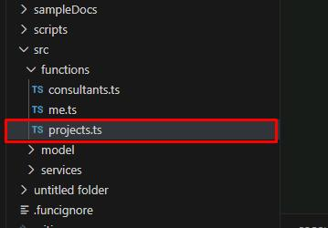
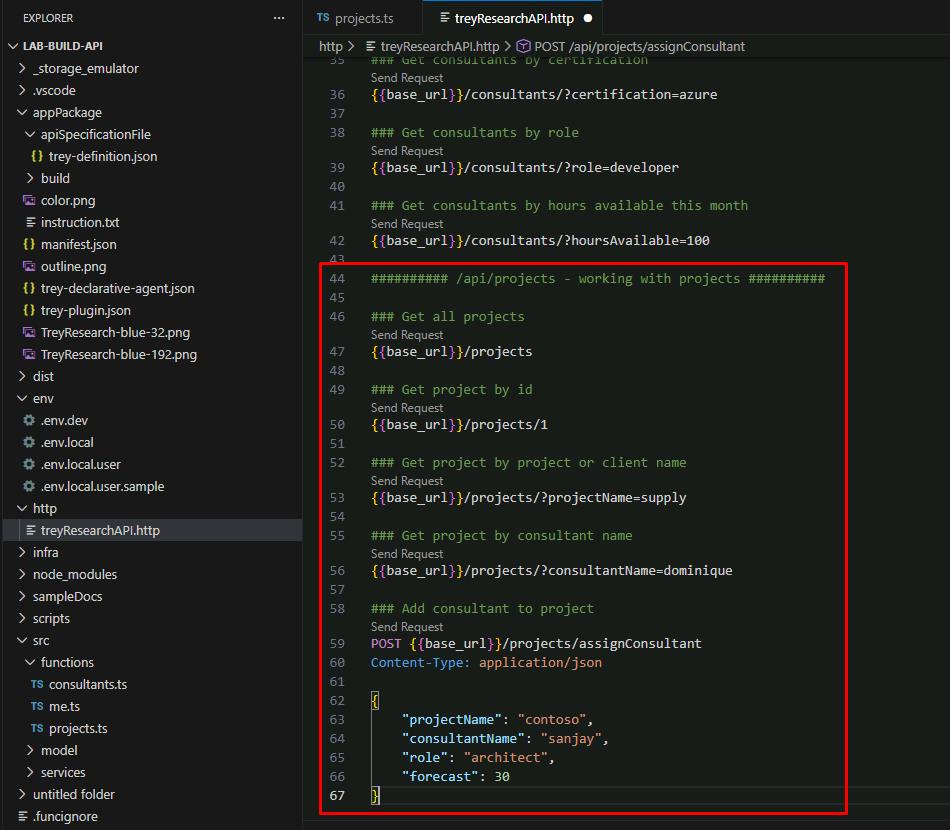
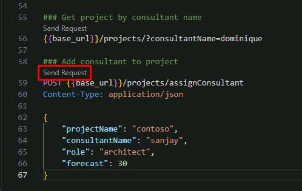
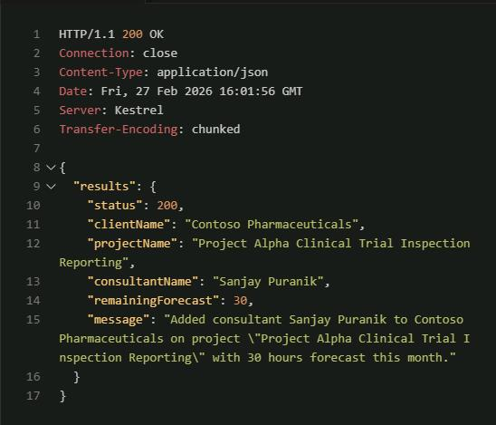

## Task 01: Add /projects resource

### Description

You'll create a new Azure Function file that handles GET and POST requests for the `/projects` path, then add HTTP test requests to the `.http` file so you can verify the new endpoints manually before wiring them into the plugin.

### Success criteria

- You created `src/functions/projects.ts` with the provided code and saved the file without errors.
- You added the HTTP test block for `/api/projects` to `treyResearchAPI.http`.
- You started the debugger, sent the POST assign-consultant request, and received a successful response.


### Key steps

---

#### 01: Add Azure function code

1. In the **EXPLORER** pane, expand **src**, then select **functions**.

1. Right-click the **functions** folder, then select **New File**.

1. Name the file `projects.ts`.

    

1. Enter the following code block in **projects.ts**:

    {: .highlight }
    > Select **Copy** in the following block, then paste with **Ctrl+V**.

    ```
    /* This code sample provides a starter kit to implement server side logic for your Teams App in TypeScript,
    * refer to https://docs.microsoft.com/en-us/azure/azure-functions/functions-reference for complete Azure Functions
    * developer guide.
    */

    import { app, HttpRequest, HttpResponseInit, InvocationContext } from "@azure/functions";
    import ProjectApiService from "../services/ProjectApiService";
    import { ApiProject, ApiAddConsultantToProjectResponse, ErrorResult } from "../model/apiModel";
    import { HttpError, cleanUpParameter } from "../services/Utilities";
    import IdentityService from "../services/IdentityService";

    /**
    * This function handles the HTTP request and returns the project information.
    *
    * @param {HttpRequest} req - The HTTP request.
    * @param {InvocationContext} context - The Azure Functions context object.
    * @returns {Promise<Response>} - A promise that resolves with the HTTP response containing the project information.
    */

    // Define a Response interface.
    interface Response extends HttpResponseInit {
        status: number;
        jsonBody: {
            results: ApiProject| ApiAddConsultantToProjectResponse | ErrorResult;
        };
    }
    export async function projects(
        req: HttpRequest,
        context: InvocationContext
    ): Promise<Response> {
        context.log("HTTP trigger function projects processed a request.");
        // Initialize response.
        const res: Response = {
            status: 200,
            jsonBody: {
                results: [],
            },
        };

        try {

            // Will throw an exception if the request is not valid
            const userInfo = await IdentityService.validateRequest(req);

            const id = req.params?.id?.toLowerCase();
            let body = null;
            switch (req.method) {
                case "GET": {

                    let projectName = req.query.get("projectName")?.toString().toLowerCase() || "";
                    let consultantName = req.query.get("consultantName")?.toString().toLowerCase() || "";

                    console.log(`➡️ GET /api/projects: request for projectName=${projectName}, consultantName=${consultantName}, id=${id}`);

                    projectName = cleanUpParameter("projectName", projectName);
                    consultantName = cleanUpParameter("consultantName", consultantName);

                    if (id) {
                        const result = await ProjectApiService.getApiProjectById(id);
                        res.jsonBody.results = [result];
                        console.log(`   ✅ GET /api/projects: response status ${res.status}; 1 projects returned`);
                        return res;
                    }

                    // Use current user if the project name is user_profile
                    if (projectName.includes('user_profile')) {
                        const result = await ProjectApiService.getApiProjects("", userInfo.name);
                        res.jsonBody.results = result;
                        console.log(`   ✅ GET /api/projects for current user response status ${res.status}; ${result.length} projects returned`);
                        return res;
                    }

                    const result = await ProjectApiService.getApiProjects(projectName, consultantName);
                    res.jsonBody.results = result;
                    console.log(`   ✅ GET /api/projects: response status ${res.status}; ${result.length} projects returned`);
                    return res;
                }
                case "POST": {
                    switch (id.toLocaleLowerCase()) {
                        case "assignconsultant": {
                            try {
                                const bd = await req.text();
                                body = JSON.parse(bd);
                            } catch (error) {
                                throw new HttpError(400, `No body to process this request.`);
                            }
                            if (body) {
                                const projectName = cleanUpParameter("projectName", body["projectName"]);
                                if (!projectName) {
                                    throw new HttpError(400, `Missing project name`);
                                }
                                const consultantName = cleanUpParameter("consultantName", body["consultantName"]?.toString() || "");
                                if (!consultantName) {
                                    throw new HttpError(400, `Missing consultant name`);
                                }
                                const role = cleanUpParameter("Role", body["role"]);
                                if (!role) {
                                    throw new HttpError(400, `Missing role`);
                                }
                                let forecast = body["forecast"];
                                if (!forecast) {
                                    forecast = 0;
                                    //throw new HttpError(400, `Missing forecast this month`);
                                }
                                console.log(`➡️ POST /api/projects: assignconsultant request, projectName=${projectName}, consultantName=${consultantName}, role=${role}, forecast=${forecast}`);
                                const result = await ProjectApiService.addConsultantToProject
                                    (projectName, consultantName, role, forecast);

                                res.jsonBody.results = {
                                    status: 200,
                                    clientName: result.clientName,
                                    projectName: result.projectName,
                                    consultantName: result.consultantName,
                                    remainingForecast: result.remainingForecast,
                                    message: result.message
                                };

                                console.log(`   ✅ POST /api/projects: response status ${res.status} - ${result.message}`);
                            } else {
                                throw new HttpError(400, `Missing request body`);
                            }
                            return res;
                        }
                        default: {
                            throw new HttpError(400, `Invalid command: ${id}`);
                        }
                    }

                }
                default: {
                    throw new Error(`Method not allowed: ${req.method}`);
                }
            }

        } catch (error) {

            const status = <number>error.status || <number>error.response?.status || 500;
            console.log(`   ⛔ Returning error status code ${status}: ${error.message}`);

            res.status = status;
            res.jsonBody.results = {
                status: status,
                message: error.message
            };
            return res;
        }
    }

    app.http("projects", {
        methods: ["GET", "POST"],
        authLevel: "anonymous",
        route: "projects/{*id}",
        handler: projects,
    });
    ```

    {: .note }
    > This implements a new Azure function to provide access to Trey Research projects.

---

#### 02: Review the Azure function code (optional)

Let's take a moment to review the code you just added.

This is a version 4 Azure function, so the code looks a lot like traditional Express code for NodeJS. The **projects** class implements an HTTP request trigger, which is called when the **"/projects"** path is accessed. This is followed by some inline code that defines the methods and route. For now, access is anonymous.

- Observe the following section:

    ```typescript
    export async function projects(
        req: HttpRequest,
        context: InvocationContext
    ): Promise<Response> {
        // ...
    }
    app.http("projects", {
        methods: ["GET", "POST"],
        authLevel: "anonymous",
        route: "projects/{*id}",
        handler: projects,
    });
    ```

    {: .important }
    > The class includes a switch statement for handling GET vs. POST requests and obtains the parameters from the URL path (in the case of a project ID), query strings (such as **?projectName=foo**, in the case of a GET), and the request body (in the case of a POST). 
    >
    > It then accesses the project data using the [ProjectApiService](https://github.com/microsoft/copilot-camp/blob/main/src/extend-m365-copilot/path-e-lab04-enhance-api-plugin/trey-research-lab04-END/src/services/ProjectApiService.ts), which was part of the starting solution. It also sends responses for each request and the logging of requests to the debug console.

---

#### 03: Add HTTP test requests

You'll need to add the new requests to the **.http** file you configured in an earlier task.

1. Open **http**, then select **treyResearchAPI.http**.

1. At the bottom of the file, enter the following block of requests for the API:

    ```
    ########## /api/projects - working with projects ##########

    ### Get all projects
    {{base_url}}/projects

    ### Get project by id
    {{base_url}}/projects/1

    ### Get project by project or client name
    {{base_url}}/projects/?projectName=supply

    ### Get project by consultant name
    {{base_url}}/projects/?consultantName=dominique

    ### Add consultant to project
    POST {{base_url}}/projects/assignConsultant
    Content-Type: application/json

    {
        "projectName": "contoso",
        "consultantName": "sanjay",
        "role": "architect",
        "forecast": 30
    }
    ```

    


---

#### 04: Test the new resource

1. Save all your changes by selecting **File**, then **Save All**.

3. In the top menu bar, select **Run**, then **Start Debugging**.

    {: .note }
    > Once started, Edge will take you back to the **Trey Genie Local** agent.

1. Minimize Microsoft Edge.
    
    {: .warning }
    > Do not close the window as that will stop the debugger.

1. In **treyResearchAPI.http**, try selecting **Send Request** to assign a new consultant to a project using the POST request under line 58.

    

1. Observe the response.

    

1. Feel free to try sending other requests for project details.

1. Once finished, in the top menu bar, select **Run**, then **Stop Debugging**.

1. Close any VS Code tabs and the **Response** pane.
