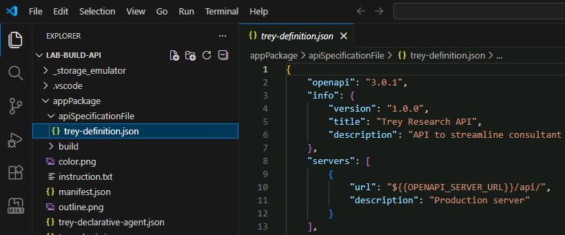
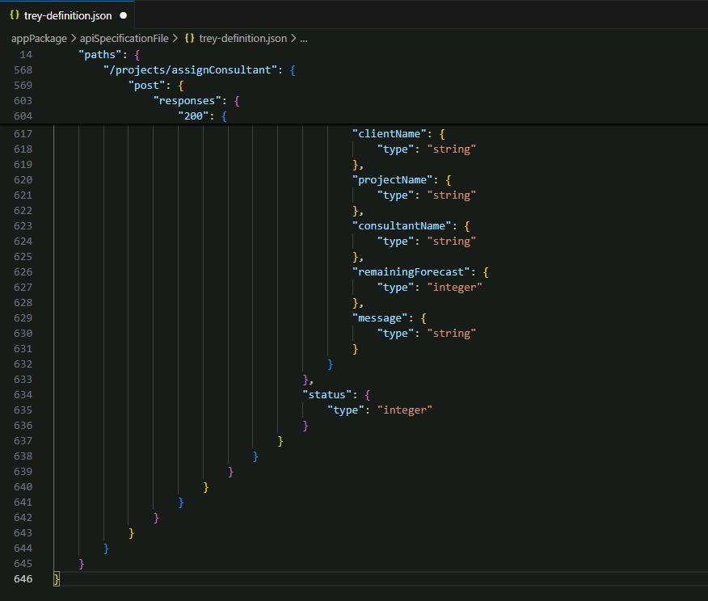
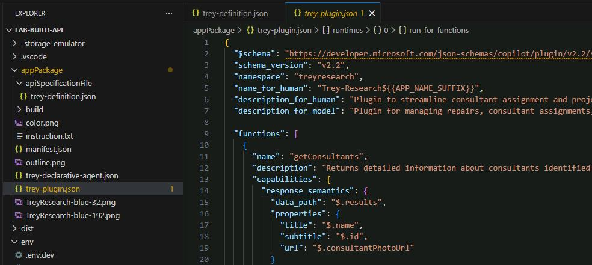
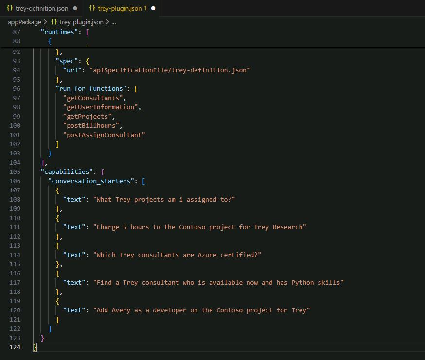

## Task 02: Add projects to the application package

### Description

You'll update the OpenAPI Specification file and the plugin definition file to include the new `/projects` endpoints, so Copilot knows how to discover and call them at runtime.

### Success criteria

- You replaced `trey-definition.json` with the updated version including the `/projects/` GET path and the `/projects/assignConsultant` POST path.
- You replaced `trey-plugin.json` with the updated version including `getProjects` and `postAssignConsultant` in both the `functions` array and `run_for_functions` list.

### Key steps

---

#### 01: Update the Open API Specification file

An important part of the application package is the [Open API Specification (OAS)](https://swagger.io/specification/) definition file. OAS defines a standard format for describing a REST API and is based on the popular "Swagger" definition.

1. Open **appPackage**, select **apiSpecificationFile**, then **trey-definition.json**

    

1. Delete everything contained in the file. 

    {: .highlight }
    > Select **Ctrl+A** to highlight the whole file.

1. Replace the file content with the following:

    {: .highlight }
    > Select **Copy** in the following block, then paste with **Ctrl+V**.

    ```json
    {
        "openapi": "3.0.1",
        "info": {
            "version": "1.0.0",
            "title": "Trey Research API",
            "description": "API to streamline consultant assignment and project management."
        },
        "servers": [
            {
                "url": "${{OPENAPI_SERVER_URL}}/api/",
                "description": "Production server"
            }
        ],
        "paths": {
            "/consultants/": {
                "get": {
                    "operationId": "getConsultants",
                    "summary": "Get consultants working at Trey Research based on consultant name, project name, certifications, skills, roles and hours available",
                    "description": "Returns detailed information about consultants identified from filters like name of the consultant, name of project, certifications, skills, roles and hours available. Multiple filters can be used in combination to refine the list of consultants returned",
                    "parameters": [
                        {
                            "name": "consultantName",
                            "in": "query",
                            "description": "Name of the consultant to retrieve",
                            "required": false,
                            "schema": {
                                "type": "string"
                            }
                        },
                        {
                            "name": "projectName",
                            "in": "query",
                            "description": "The name of the project",
                            "required": false,
                            "schema": {
                                "type": "string"
                            }
                        },
                        {
                            "name": "skill",
                            "in": "query",
                            "description": "Skills for a consultant. Retrieve consultants with this skill",
                            "required": false,
                            "schema": {
                                "type": "string"
                            }
                        },
                        {
                            "name": "certification",
                            "in": "query",
                            "description": "Certification for a consultant. Retrieve consultants with this certification",
                            "required": false,
                            "schema": {
                                "type": "string"
                            }
                        },
                        {
                            "name": "role",
                            "in": "query",
                            "description": "Role of a consultant. Retrieve consultants with this role",
                            "required": false,
                            "schema": {
                                "type": "string"
                            }
                        },
                        {
                            "name": "hoursAvailable",
                            "in": "query",
                            "description": "Hours a consultant is available for new work over this and next month. Please provide an integer value; for example 0 if no hours are available, 1 if any hours are available, or 20 if 20 or more hours are available.",
                            "required": false,
                            "schema": {
                                "type": "string"
                            }
                        }
                    ],
                    "responses": {
                        "200": {
                            "description": "Successful response",
                            "content": {
                                "application/json": {
                                    "schema": {
                                        "type": "object",
                                        "properties": {
                                            "results": {
                                                "type": "array",
                                                "items": {
                                                    "type": "object",
                                                    "properties": {
                                                        "id": {
                                                            "type": "string"
                                                        },
                                                        "name": {
                                                            "type": "string"
                                                        },
                                                        "email": {
                                                            "type": "string",
                                                            "format": "email"
                                                        },
                                                        "phone": {
                                                            "type": "string"
                                                        },
                                                        "location": {
                                                            "type": "object",
                                                            "properties": {
                                                                "street": {
                                                                    "type": "string"
                                                                },
                                                                "city": {
                                                                    "type": "string"
                                                                },
                                                                "state": {
                                                                    "type": "string"
                                                                },
                                                                "country": {
                                                                    "type": "string"
                                                                },
                                                                "postalCode": {
                                                                    "type": "string"
                                                                },
                                                                "latitude": {
                                                                    "type": "number"
                                                                },
                                                                "longitude": {
                                                                    "type": "number"
                                                                }
                                                            }
                                                        },
                                                        "skills": {
                                                            "type": "array",
                                                            "items": {
                                                                "type": "string"
                                                            }
                                                        },
                                                        "certifications": {
                                                            "type": "array",
                                                            "items": {
                                                                "type": "string"
                                                            }
                                                        },
                                                        "roles": {
                                                            "type": "array",
                                                            "items": {
                                                                "type": "string"
                                                            }
                                                        },
                                                        "consultantPhotoUrl": {
                                                            "type": "string",
                                                            "format": "uri"
                                                        },
                                                        "projects": {
                                                            "type": "array",
                                                            "items": {
                                                                "type": "object",
                                                                "properties": {
                                                                    "projectName": {
                                                                        "type": "string"
                                                                    },
                                                                    "projectDescription": {
                                                                        "type": "string"
                                                                    },
                                                                    "projectLocation": {
                                                                        "type": "object",
                                                                        "properties": {
                                                                            "street": {
                                                                                "type": "string"
                                                                            },
                                                                            "city": {
                                                                                "type": "string"
                                                                            },
                                                                            "state": {
                                                                                "type": "string"
                                                                            },
                                                                            "country": {
                                                                                "type": "string"
                                                                            },
                                                                            "postalCode": {
                                                                                "type": "string"
                                                                            },
                                                                            "latitude": {
                                                                                "type": "number"
                                                                            },
                                                                            "longitude": {
                                                                                "type": "number"
                                                                            }
                                                                        }
                                                                    },
                                                                    "mapUrl": {
                                                                        "type": "string",
                                                                        "format": "uri"
                                                                    },
                                                                    "role": {
                                                                        "type": "string"
                                                                    },
                                                                    "forecastThisMonth": {
                                                                        "type": "integer"
                                                                    },
                                                                    "forecastNextMonth": {
                                                                        "type": "integer"
                                                                    },
                                                                    "deliveredLastMonth": {
                                                                        "type": "integer"
                                                                    },
                                                                    "deliveredThisMonth": {
                                                                        "type": "integer"
                                                                    }
                                                                }
                                                            }
                                                        },
                                                        "forecastThisMonth": {
                                                            "type": "integer"
                                                        },
                                                        "forecastNextMonth": {
                                                            "type": "integer"
                                                        },
                                                        "deliveredLastMonth": {
                                                            "type": "integer"
                                                        },
                                                        "deliveredThisMonth": {
                                                            "type": "integer"
                                                        }
                                                    }
                                                }
                                            },
                                            "status": {
                                                "type": "integer"
                                            }
                                        }
                                    }
                                }
                            }
                        },
                        "404": {
                            "description": "Consultant not found"
                        }
                    }
                }
            },
            "/me": {
                "get": {
                    "operationId": "getUserInformation",
                    "summary": "Get consultant profile of the logged in user.",
                    "description": "Retrieve the consultant profile for the logged-in user including skills, roles, certifications, location, availability, and project assignments.",
                    "responses": {
                        "200": {
                            "description": "Successful response",
                            "content": {
                                "application/json": {
                                    "schema": {
                                        "type": "object",
                                        "properties": {
                                            "results": {
                                                "type": "array",
                                                "items": {
                                                    "type": "object",
                                                    "properties": {
                                                        "id": {
                                                            "type": "string"
                                                        },
                                                        "name": {
                                                            "type": "string"
                                                        },
                                                        "email": {
                                                            "type": "string",
                                                            "format": "email"
                                                        },
                                                        "phone": {
                                                            "type": "string"
                                                        },
                                                        "location": {
                                                            "type": "object",
                                                            "properties": {
                                                                "street": {
                                                                    "type": "string"
                                                                },
                                                                "city": {
                                                                    "type": "string"
                                                                },
                                                                "state": {
                                                                    "type": "string"
                                                                },
                                                                "country": {
                                                                    "type": "string"
                                                                },
                                                                "postalCode": {
                                                                    "type": "string"
                                                                },
                                                                "latitude": {
                                                                    "type": "number"
                                                                },
                                                                "longitude": {
                                                                    "type": "number"
                                                                }
                                                            }
                                                        },
                                                        "skills": {
                                                            "type": "array",
                                                            "items": {
                                                                "type": "string"
                                                            }
                                                        },
                                                        "certifications": {
                                                            "type": "array",
                                                            "items": {
                                                                "type": "string"
                                                            }
                                                        },
                                                        "roles": {
                                                            "type": "array",
                                                            "items": {
                                                                "type": "string"
                                                            }
                                                        },
                                                        "consultantPhotoUrl": {
                                                            "type": "string",
                                                            "format": "uri"
                                                        },
                                                        "projects": {
                                                            "type": "array",
                                                            "items": {
                                                                "type": "object",
                                                                "properties": {
                                                                    "projectName": {
                                                                        "type": "string"
                                                                    },
                                                                    "projectDescription": {
                                                                        "type": "string"
                                                                    },
                                                                    "projectLocation": {
                                                                        "type": "object",
                                                                        "properties": {
                                                                            "street": {
                                                                                "type": "string"
                                                                            },
                                                                            "city": {
                                                                                "type": "string"
                                                                            },
                                                                            "state": {
                                                                                "type": "string"
                                                                            },
                                                                            "country": {
                                                                                "type": "string"
                                                                            },
                                                                            "postalCode": {
                                                                                "type": "string"
                                                                            },
                                                                            "latitude": {
                                                                                "type": "number"
                                                                            },
                                                                            "longitude": {
                                                                                "type": "number"
                                                                            }
                                                                        }
                                                                    },
                                                                    "mapUrl": {
                                                                        "type": "string",
                                                                        "format": "uri"
                                                                    },
                                                                    "role": {
                                                                        "type": "string"
                                                                    },
                                                                    "forecastThisMonth": {
                                                                        "type": "integer"
                                                                    },
                                                                    "forecastNextMonth": {
                                                                        "type": "integer"
                                                                    },
                                                                    "deliveredLastMonth": {
                                                                        "type": "integer"
                                                                    },
                                                                    "deliveredThisMonth": {
                                                                        "type": "integer"
                                                                    }
                                                                }
                                                            }
                                                        },
                                                        "forecastThisMonth": {
                                                            "type": "integer"
                                                        },
                                                        "forecastNextMonth": {
                                                            "type": "integer"
                                                        },
                                                        "deliveredLastMonth": {
                                                            "type": "integer"
                                                        },
                                                        "deliveredThisMonth": {
                                                            "type": "integer"
                                                        }
                                                    }
                                                }
                                            }
                                        }
                                    }
                                }
                            }
                        }
                    }
                }
            },
            "/projects/": {
                "get": {
                    "operationId": "getProjects",
                    "summary": "Get projects matching a specified project name and/or consultant name",
                    "description": "Returns detailed information about projects matching the specified project name and/or consultant name",
                    "parameters": [
                        {
                            "name": "consultantName",
                            "in": "query",
                            "description": "The name of the consultant assigned to the project",
                            "required": false,
                            "schema": {
                                "type": "string"
                            }
                        },
                        {
                            "name": "projectName",
                            "in": "query",
                            "description": "The name of the project or name of the client",
                            "required": false,
                            "schema": {
                                "type": "string"
                            }
                        }
                    ],
                    "responses": {
                        "200": {
                            "description": "Successful response",
                            "content": {
                                "application/json": {
                                    "schema": {
                                        "type": "object",
                                        "properties": {
                                            "results": {
                                                "type": "array",
                                                "items": {
                                                    "type": "object",
                                                    "properties": {
                                                        "name": {
                                                            "type": "string"
                                                        },
                                                        "description": {
                                                            "type": "string"
                                                        },
                                                        "location": {
                                                            "type": "object",
                                                            "properties": {
                                                                "street": {
                                                                    "type": "string"
                                                                },
                                                                "city": {
                                                                    "type": "string"
                                                                },
                                                                "state": {
                                                                    "type": "string"
                                                                },
                                                                "country": {
                                                                    "type": "string"
                                                                },
                                                                "postalCode": {
                                                                    "type": "string"
                                                                },
                                                                "latitude": {
                                                                    "type": "number"
                                                                },
                                                                "longitude": {
                                                                    "type": "number"
                                                                }
                                                            }
                                                        },
                                                        "mapUrl": {
                                                            "type": "string",
                                                            "format": "uri"
                                                        },
                                                        "role": {
                                                            "type": "string"
                                                        },
                                                        "forecastThisMonth": {
                                                            "type": "integer"
                                                        },
                                                        "forecastNextMonth": {
                                                            "type": "integer"
                                                        },
                                                        "deliveredLastMonth": {
                                                            "type": "integer"
                                                        },
                                                        "deliveredThisMonth": {
                                                            "type": "integer"
                                                        }
                                                    }
                                                }
                                            },
                                            "status": {
                                                "type": "integer"
                                            }
                                        }
                                    }
                                }
                            }
                        },
                        "404": {
                            "description": "Project not found"
                        }
                    }
                }
            },
            "/me/chargeTime": {
                "post": {
                    "operationId": "postBillhours",
                    "summary": "Charge time to a project on behalf of the logged in user.",
                    "description": "Charge time to a specific project on behalf of the logged in user, and return the number of hours remaining in their forecast.",
                    "requestBody": {
                        "required": true,
                        "content": {
                            "application/json": {
                                "schema": {
                                    "type": "object",
                                    "properties": {
                                        "projectName": {
                                            "type": "string"
                                        },
                                        "hours": {
                                            "type": "integer"
                                        }
                                    },
                                    "required": [
                                        "projectName",
                                        "hours"
                                    ]
                                }
                            }
                        }
                    },
                    "responses": {
                        "200": {
                            "description": "Successful charge",
                            "content": {
                                "application/json": {
                                    "schema": {
                                        "type": "object",
                                        "properties": {
                                            "results": {
                                                "type": "object",
                                                "properties": {
                                                    "status": {
                                                        "type": "integer"
                                                    },
                                                    "clientName": {
                                                        "type": "string"
                                                    },
                                                    "projectName": {
                                                        "type": "string"
                                                    },
                                                    "remainingForecast": {
                                                        "type": "integer"
                                                    },
                                                    "message": {
                                                        "type": "string"
                                                    }
                                                }
                                            }
                                        }
                                    }
                                }
                            }
                        }
                    }
                }
            },
            "/projects/assignConsultant": {
                "post": {
                    "operationId": "postAssignConsultant",
                    "summary": "Assign consultant to a project when name, role and project name is specified.",
                    "description": "Assign (add) consultant to a project when name, role and project name is specified.",
                    "requestBody": {
                        "required": true,
                        "content": {
                            "application/json": {
                                "schema": {
                                    "type": "object",
                                    "properties": {
                                        "projectName": {
                                            "type": "string"
                                        },
                                        "consultantName": {
                                            "type": "string"
                                        },
                                        "role": {
                                            "type": "string"
                                        },
                                        "forecast": {
                                            "type": "integer"
                                        }
                                    },
                                    "required": [
                                        "projectName",
                                        "consultantName",
                                        "role",
                                        "forecast"
                                    ]
                                }
                            }
                        }
                    },
                    "responses": {
                        "200": {
                            "description": "Successful assignment",
                            "content": {
                                "application/json": {
                                    "schema": {
                                        "type": "object",
                                        "properties": {
                                            "results": {
                                                "type": "object",
                                                "properties": {
                                                    "status": {
                                                        "type": "integer"
                                                    },
                                                    "clientName": {
                                                        "type": "string"
                                                    },
                                                    "projectName": {
                                                        "type": "string"
                                                    },
                                                    "consultantName": {
                                                        "type": "string"
                                                    },
                                                    "remainingForecast": {
                                                        "type": "integer"
                                                    },
                                                    "message": {
                                                        "type": "string"
                                                    }
                                                }
                                            },
                                            "status": {
                                                "type": "integer"
                                            }
                                        }
                                    }
                                }
                            }
                        }
                    }
                }
            }
        }
    }
    ```

    {: .note }
    > You can review the file in the next task to understand the changes.

    

---

#### 02: Review the updates (optional)

The first update was to add the **/projects/** path to the **paths** collection in the JSON. 

- Observe the **"/projects/"** section:

    ```json
    "/projects/": {
        "get": {
            "operationId": "getProjects",
            "summary": "Get projects matching a specified project name and/or consultant name",
            "description": "Returns detailed information about projects matching the specified project name and/or consultant name",
            "parameters": [
                {
                    "name": "consultantName",
                    "in": "query",
                    "description": "The name of the consultant assigned to the project",
                    "required": false,
                    "schema": {
                        "type": "string"
                    }
                },
    ...
    ```

    {: .note }
    > You can see this includes all the available query strings when retrieving the **/projects/** resource, along with data types and required fields. It also includes the data that will be returned in API responses, including different payloads for status **200 (successful)** and **400 (failed)** responses.
    >
    > You'll also find that a path has been added at **/projects/assignConsultant** to handle the POST requests.

---

{: .important }
> **Descriptions are important**
>
> All files in the app package will be read by AI. You can help Copilot properly use your API by using descriptive names and descriptions in this and all other application package files.

---

#### 03: Add projects to the plugin definition file

1. Open **appPackage**, then select **trey-plugin.json**.
    
    

    {: .note }
    > This file contains extra information not included in the OAS definition file.

1. Delete everything contained in the file. 

1. Replace the file content with the following:

    {: .important }
    > Select **Copy** in the following block, then paste with **Ctrl+V**.

    ```json
    {
      "$schema": "https://developer.microsoft.com/json-schemas/copilot/plugin/v2.2/schema.json",
      "schema_version": "v2.2",
      "namespace": "treyresearch",
      "name_for_human": "Trey-Research${{APP_NAME_SUFFIX}}",
      "description_for_human": "Plugin to streamline consultant assignment and project management.",
      "description_for_model": "Plugin for managing repairs, consultant assignments, and project tracking within Trey Research. Provides functionalities to list repairs with details and images.",
      "functions": [
        {
          "name": "getConsultants",
          "description": "Returns detailed information about consultants identified from filters like name of the consultant, name of project, certifications, skills, roles and hours available. Multiple filters can be used in combination to refine the list of consultants returned",
          "capabilities": {
            "response_semantics": {
              "data_path": "$.results",
              "properties": {
                "title": "$.name",
                "subtitle": "$.id",
                "url": "$.consultantPhotoUrl"
              }
            }
          }
        },
        {
          "name": "getUserInformation",
          "description": "Retrieve the consultant profile for the logged-in user including skills, roles, certifications, location, availability, and project assignments.",
          "capabilities": {
            "response_semantics": {
              "data_path": "$.results",
              "properties": {
                "title": "$.name",
                "subtitle": "$.id",
                "url": "$.consultantPhotoUrl"
              }
            }
          }
        },
        {
          "name": "getProjects",
          "description": "Returns detailed information about projects matching the specified project name and/or consultant name by searching scripts under ./scripts/db/",
          "capabilities": {
            "response_semantics": {
              "data_path": "$.results",
              "properties": {
                "title": "$.name",
                "subtitle": "$.description"
              }
            }
          }
        },
        {
          "name": "postBillhours",
          "description": "Charge time to a specific project on behalf of the logged in user, and return the number of hours remaining in their forecast.",
          "capabilities": {
            "response_semantics": {
              "data_path": "$",
              "properties": {
                "title": "$.results.clientName",
                "subtitle": "$.results.status"
              }
            },
            "confirmation": {
              "type": "AdaptiveCard",
              "title": "Charge time to a project on behalf of the logged in user.",
              "body": "**ProjectName**: {{function.parameters.projectName}}\n* **Hours**: {{function.parameters.hours}}"
            }
          }
        },
        {
          "name": "postAssignConsultant",
          "description": "Assign (add) consultant to a project when name, role and project name is specified.",
          "capabilities": {
            "response_semantics": {
              "data_path": "$",
              "properties": {
                "title": "$.results.clientName",
                "subtitle": "$.results.status"
              }
            },
            "confirmation": {
              "type": "AdaptiveCard",
              "title": "Assign consultant to a project when name, role and project name is specified.",
              "body": "**ProjectName**: {{function.parameters.projectName}}\n* **ConsultantName**: {{function.parameters.consultantName}}\n* **Role**: {{function.parameters.role}}\n* **Forecast**: {{function.parameters.forecast}}"
            }
          }
        }
      ],
      "runtimes": [
        {
          "type": "OpenApi",
          "auth": {
            "type": "None"
          },
          "spec": {
            "url": "apiSpecificationFile/trey-definition.json"
          },
          "run_for_functions": [
            "getConsultants",
            "getUserInformation",
            "getProjects",
            "postBillhours",
            "postAssignConsultant"
          ]
        }
      ],
      "capabilities": {
        "conversation_starters": [
          {
            "text": "What Trey projects am i assigned to?"
          },
          {
            "text": "Charge 5 hours to the Contoso project for Trey Research"
          },
          {
            "text": "Which Trey consultants are Azure certified?"
          },
          {
            "text": "Find a Trey consultant who is available now and has Python skills"
          },
          {
            "text": "Add Avery as a developer on the Contoso project for Trey"
          }
        ]
      }
    }
    ```

    

---

#### 04: Review the changes to the plugin definition file (optional)

The plugin JSON file contains a collection of _functions_, each of which corresponds to a type of API call. Copilot will choose among these functions when utilizing your plugin at runtime.

The new **trey-plugin.json** file includes new functions **getProjects** and **postAssignConsultant**. 

Here's **getProjects**:

```json
{
    "name": "getProjects",
    "description": "Returns detailed information about projects matching the specified project name and/or consultant name",
    "capabilities": {
        "response_semantics": {
            "data_path": "$.results",
            "properties": {
            "title": "$.name",
            "subtitle": "$.description"
            }
        }
    }
},
```

This includes **response_semantics** which instructs Copilot's orchestrator on how to interpret the response payload. It defines the mapping of structured data in a response payload to specific properties required by the function. It enables the orchestrator to interpret and transform raw response data into meaningful content for rendering or further processing.

For example, look at the response semantics below:

```json
"functions": [
    {
      "name": "getConsultants",
      "description": "Returns detailed information about consultants identified from filters like name of the consultant, name of project, certifications, skills, roles and hours available. Multiple filters can be used in combination to refine the list of consultants returned",
      "capabilities": {
        "response_semantics": {
          "data_path": "$.results",
          "properties": {
            "title": "$.name",
            "subtitle": "$.id",
            "url": "$.consultantPhotoUrl"
          }
        }
      }
    },
    ...
]
```

Here **data_path** is **$.results** in the **response_semantics** of function **getConsultants**. This means the main data resides under the **results** key in the JSON, which ensures the system extracts data starting at that path. It also defines mappings of specific fields from the raw data to corresponding semantic properties under **properties** field to readily use it for rendering.

```json
"title": "$.name",
"subtitle": "$.id",
"url": "$.consultantPhotoUrl"
```

The POST request has a similar function:

```json
{
    "name": "postAssignConsultant",
    "description": "Assign (add) consultant to a project when name, role and project name is specified.",
    "capabilities": {
        "response_semantics": {
            "data_path": "$",
            "properties": {
            "title": "$.results.clientName",
            "subtitle": "$.results.status"
            }
        },
        "confirmation": {
            "type": "AdaptiveCard",
            "title": "Assign consultant to a project when name, role and project name is specified.",
            "body": "**ProjectName**: {{function.parameters.projectName}}\n* **ConsultantName**: {{function.parameters.consultantName}}\n* **Role**: {{function.parameters.role}}\n* **Forecast**: {{function.parameters.forecast}}"
        }
    }
}
```

It includes an [adaptive card](https://adaptivecards.io) to be used in the confirmation card, which is shown to users to confirm an action prior to issuing a POST request.

Moving down, you can see the **runtimes** object which defines the type of plugin, the OAS definition file location, and a list of functions. The new functions have been added to the list.

```json
"runtimes": [
    {
        "type": "OpenApi",
        "auth": {
        "type": "None"
        },
            "spec": {
            "url": "trey-definition.json"
        },
        "run_for_functions": [
            "getConsultants",
            "getUserInformation",
            "getProjects",
            "postBillhours",
            "postAssignConsultant"
        ]
    }
],
```

Finally, it includes some conversation starters which are prompt suggestions shown to users. The new file has a conversation starter relating to projects.

```json
"capabilities": {
    "localization": {},
    "conversation_starters": [
        {
            "text": "What Trey projects am i assigned to?"
        },
        {
            "text": "Charge 5 hours to the Contoso project for Trey Research"
        },
        {
            "text": "Which Trey consultants are Azure certified?"
        },
        {
            "text": "Find a Trey consultant who is available now and has Python skills"
        },
        {
            "text": "Add Avery as a developer on the Contoso project for Trey"
        }
    ]
}
```
