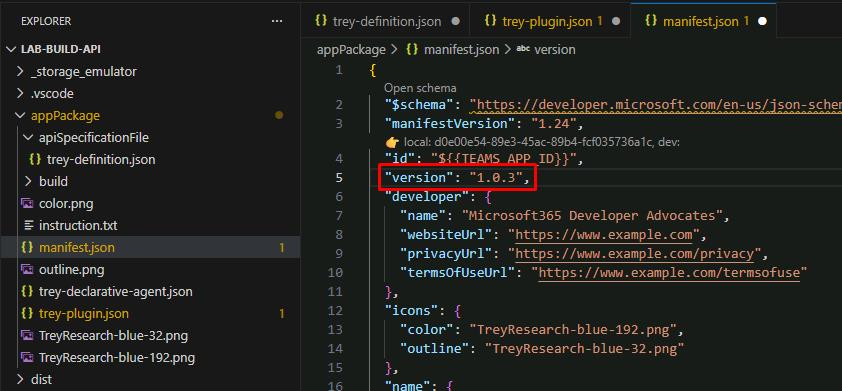
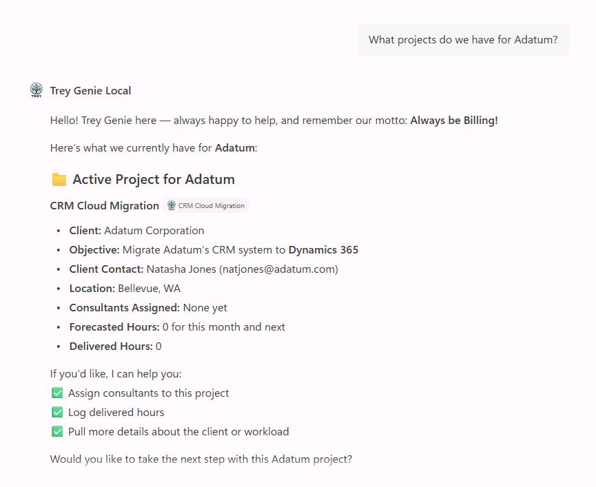
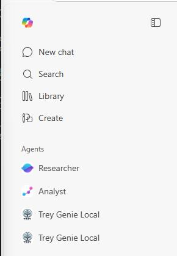

## Task 03: Test the plugin in Copilot

### Description

You'll increment the app manifest version to ensure the updated package is installed, start the debugger, and verify the agent can answer project-related queries using the new `/projects` endpoint.

### Success criteria

- You incremented the manifest version number.
- You started the debugger and the **Trey Genie Local** agent opened without errors.
- You sent a project query and received a valid response referencing Adatum project data.

### Key steps

---

#### 01: Update manifest version

Before you test the application, update the manifest version of your app package in the **manifest.json** file.

1. Open **appPackage**, then select **manifest.json**.

1. Locate the **version** property on line 5.

1. Increment the version number. If it's at **1.0.2**, update to `"1.0.3"`.

    

---

#### 02: Test the agent

1. Save all your changes by selecting **File**, then **Save All**.

1. In the top menu bar, select **Run**, then **Start Debugging**.

    {: .note }
    > Once started, Edge will take you back to the **Trey Genie Local** agent.

1. Prompt the Trey Genie Local agent:

    `What projects do we have for Adatum?`

    

    {: .warning }
    > If it's unable to find any projects: check the leftmost pane to see if you have another **Trey Genie Local** agent listed. Try from there.
    >
    > 

1. In VS Code's top menu bar, select **Run**, then **Stop Debugging**.

1. Close any open tabs in VS Code.

---

### **Congratulations!**

You've now completed enhancing your API plugin.