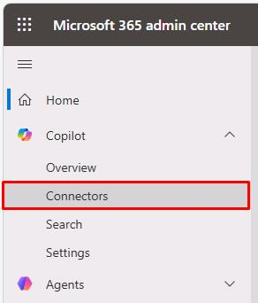
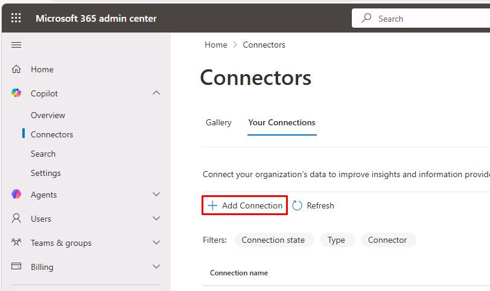
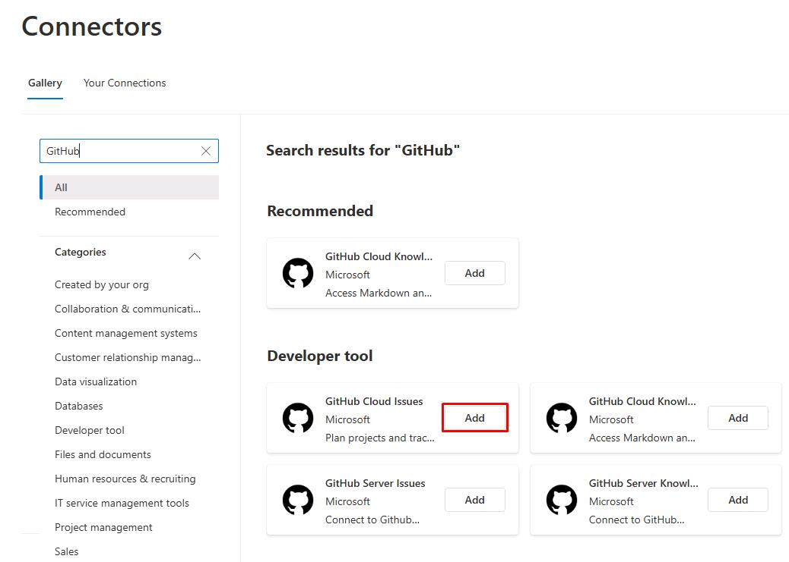
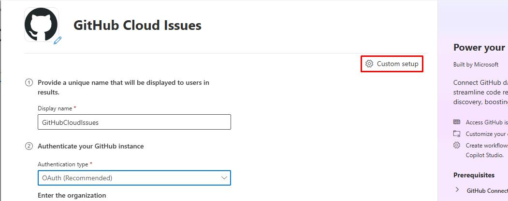
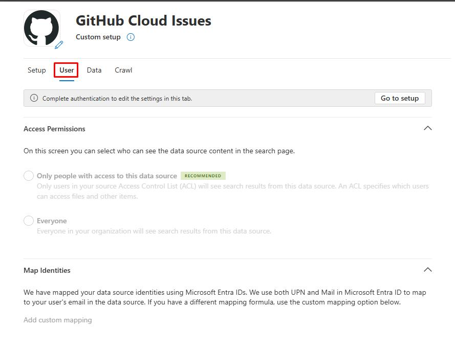

## Task 01: Deploy Copilot Connector

### Description
Microsoft 365 Copilot connectors allow you to bring external, line-of-business data into Microsoft 365 Copilot so your users can search, reason over, and act on more of your enterprise content. The platform supports two connector models:

- **Synced connectors** ingest and index external content into Microsoft Graph.
- **Federated connectors (early access preview)** retrieve content in real time using Model Context Protocol (MCP) without indexing data into Microsoft Graph.

Both connector types power Microsoft 365 Copilot and other Microsoft 365 intelligent experiences, such as Microsoft Search, Context IQ, and Microsoft 365 Copilot.

### Success criteria

- You navigated to the **Connectors** page in the Microsoft 365 admin center and identified the connector setup steps.
- You confirmed the pre-configured GitHub Cloud Issues connector returns results for "Project Alpha" in Microsoft 365 Search.
- You added the `GraphConnectors` capability block to `trey-declarative-agent.json` and updated the agent instructions.

### Key steps

---

#### 01: Setting up a Microsoft 365 Copilot connector

{: .warning }
> **NOTE:** Observe the following steps on this page, as your lab account does not have tenant level permissions. 
>
> If you have your own test tenant, you can follow along from there.

1. Open Microsoft Edge, then go to ++admin.cloud.microsoft++.

1. In the leftmost pane, go to **Copilot** > **Connectors**.

    

1. Above the table, select **Add Connection**.

	

    {: .note }
    > You'll see many prebuilt third-party services you can create connections to.

1. In the search box, enter ++GitHub++.

1. In the tile for **GitHub Cloud Issues**, select **Add**.

	

1. In the flyout pane, observe the following:
    
    1. You'll see various options for **Authentication type**.

    1. Entry for your GitHub Enterprise **Organization name**.

    1. Under **Authenticate your Github instance**, there's a link to install the **Microsoft 365 Copilot** app within your GitHub organization.
    
        {: .important }
        > The GitHub connector is designed for **GitHub Enterprise**. There may be limitations with **Free** or **Team** plans.

    1. You can then **Authorize** your GitHub account to set up the connector.
    1. Near the top of the pane, select **Custom setup**.
    
       

    1. Select the **User** tab.
    
       

       {: .note }
       > Once you've authorized your account, you can restrict which users in your tenant can access the data source.
