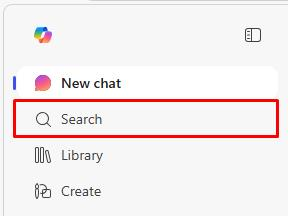
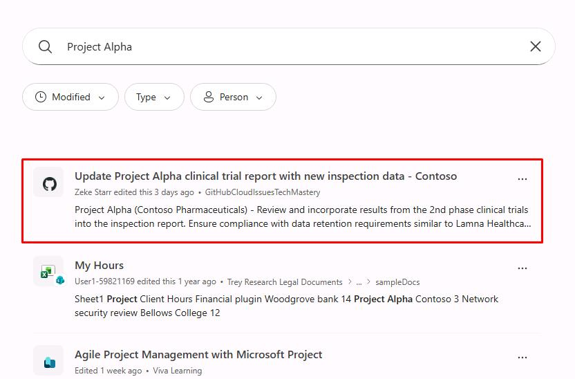
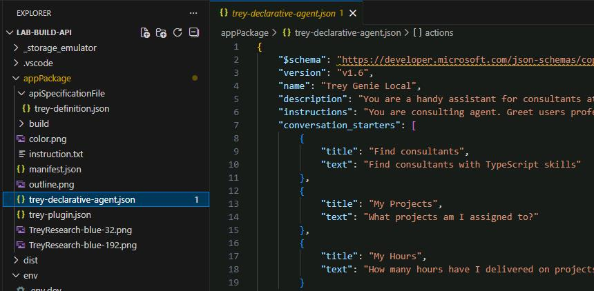
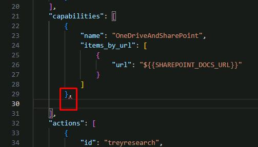
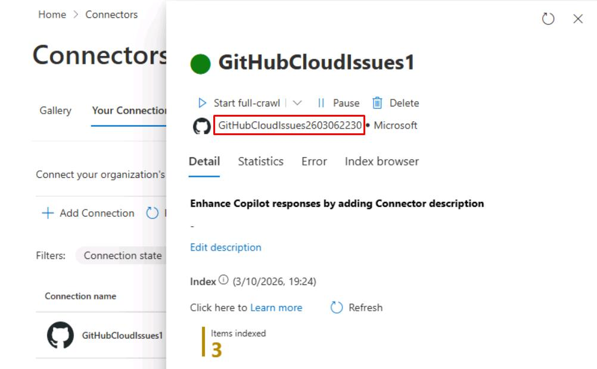
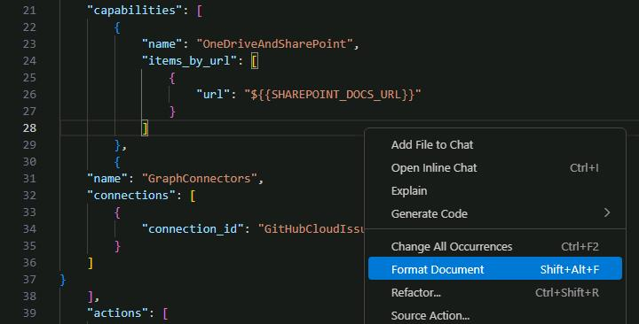
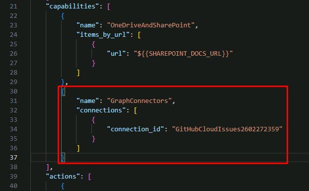
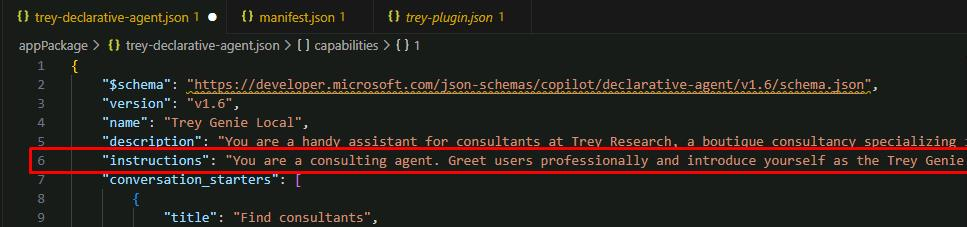
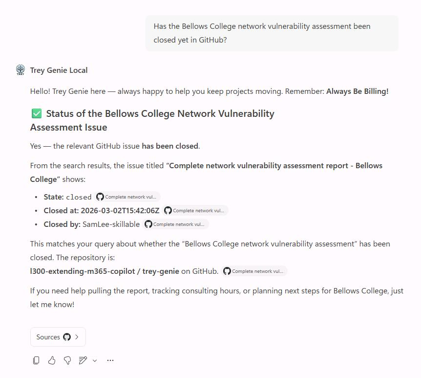
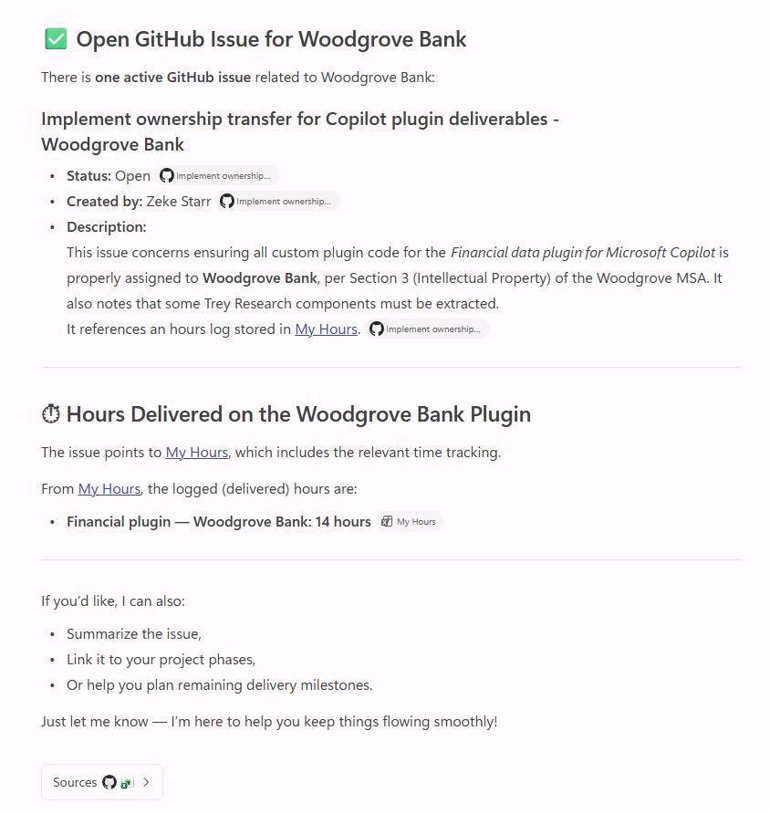

## Task 01: Deploy Copilot Connector

### Description
Microsoft 365 Copilot connectors allow you to bring external, line-of-business data into Microsoft 365 Copilot so your users can search, reason over, and act on more of your enterprise content. The platform supports two connector models:

- **Synced connectors** ingest and index external content into Microsoft Graph.
- **Federated connectors (early access preview)** retrieve content in real time using Model Context Protocol (MCP) without indexing data into Microsoft Graph.

Both connector types power Microsoft 365 Copilot and other Microsoft 365 intelligent experiences, such as Microsoft Search, Context IQ, and Microsoft 365 Copilot.

### Success criteria

- You navigated to the **Connectors** page in the Microsoft 365 admin center and identified the connector setup steps.
- You confirmed the pre-configured GitHub Cloud Issues connector returns results for "Project Alpha" in Microsoft 365 Search.
- You added the `GraphConnectors` capability block to `trey-declarative-agent.json` and updated the agent instructions.

### Key steps

---

#### 01: Setting up a Microsoft 365 Copilot connector

{: .warning }
> **NOTE:** Observe the following steps on this page, as your lab account does not have tenant level permissions. 
>
> If you have your own test tenant, you can follow along from there.

1. Open Microsoft Edge, then go to ++admin.cloud.microsoft++.

1. In the leftmost pane, go to **Copilot** > **Connectors**.

    

1. Above the table, select **Add Connection**.

	

    {: .note }
    > You'll see many prebuilt third-party services you can create connections to.

1. In the search box, enter ++GitHub++.

1. In the tile for **GitHub Cloud Issues**, select **Add**.

	

1. In the flyout pane, observe the following:
    
    1. You'll see various options for **Authentication type**.

    1. Entry for your GitHub Enterprise **Organization name**.

    1. Under **Authenticate your Github instance**, there's a link to install the **Microsoft 365 Copilot** app within your GitHub organization.
    
        {: .important }
        > The GitHub connector is designed for **GitHub Enterprise**. There may be limitations with **Free** or **Team** plans.

    1. You can then **Authorize** your GitHub account to set up the connector.
    1. Near the top of the pane, select **Custom setup**.
    
       

    1. Select the **User** tab.
    
       

       {: .note }
       > Once you've authorized your account, you can restrict which users in your tenant can access the data source.

--
 #### 02: Test the GitHub Cloud Issues connector

{: .warning }
> You can perform tasks in the lab environment again from this point forward. 
>
> We've preconfigured a connector using a GitHub Enterprise organization with sample data.

1. In a new tab, go to `m365.cloud.microsoft/chat`.

1. Close any dialogs.

1. In the leftmost pane, select **Search**.
    
    

1. In the search box, enter `Project Alpha`, then select **Enter**.

    

    {: .note }
    > In the results, you'll see it pulls an existing issue from the GitHub Enterprise organization through the Copilot connector we've preconfigured. 

---

#### 03: Add the connector to your agent

With your GitHub Enterprise organization now part of your Microsoft 365 data, you can add the connector data as focused knowledge for our declarative agent.

1. In VS Code, open **appPackage**, then select **trey-declarative-agent.json**.
    
    

1. In the **capabilities** array, on line 29, enter a comma `,` after the curly brace, then create a new line.

    

1. Add **GraphConnectors** to the array:

    ```json
    {
        "name": "GraphConnectors",
        "connections": [
            {
                "connection_id": "GitHubCloudIssues2603062230"
            }
        ]
    }
    ```

    {: .important }
    > This uses the **connection_id** of the preconfigured M365 Copilot connector. After creating a connector in the M365 admin center, open it to find the ID near the top of the pane.
    >
    > 

1. Right-click anywhere in the file, then select **Format Document** to fix the spacing.

    

    

1. Near the top of the file, replace the entire line for **"instructions"** with the following:

	`"instructions": "You are a consulting agent. Greet users professionally and introduce yourself as the Trey Genie. Offer assistance with their consulting projects and hours. Remind users of the Trey motto, 'Always be Billing!'. Your primary role is to support consultants by helping them manage their projects and hours, as well as tracking project issues. Using the TreyResearch action, you can assist users in retrieving consultant profiles or project details for administrative purposes, charge hours, and assign consultants. Do not participate in decisions related to hiring or performance evaluation. If a user inquires about hours billed or charged, rephrase the request to ask about hours 'delivered'. Additionally, you have access to GitHub Cloud Issues through Microsoft 365 Copilot connectors. You can assist users in searching, summarizing, and retrieving data regarding technical issues and bugs associated with their projects. If there is any confusion, encourage users to consult their Managing Consultant. Avoid providing legal advice.",`

    {: .note }
    > This includes new instructions to use the GitHub Cloud Issues connector.

1. Right-click anywhere in the file, then select **Format Document** to fix the spacing.

	

---

#### 04: Update manifest version

1. Open **.\appPackage\manifest.json**.

1. Increment the **version** number on line 5. If it's at **1.0.3**, update to `"1.0.4"`.

    


---

#### 05: Test the agent

1. Ensure you've saved all your changes.

1. In the top menu bar, select **Run**, ,then **Start Debugging**.

    {: .note }
    > Once started, Edge will take you back to the **Trey Genie Local** agent.

1. Ask about an issue from GitHub:

    `Has the Bellows College network vulnerability assessment issue been closed yet in GitHub?`

    

    {: .warning }
    > If it's unable to find anything, check the leftmost pane to see if you have another **Trey Genie Local** agent listed and try from there.

1. Test a prompt that has the agent check both GitHub and SharePoint:
    
    `Show me the open GitHub issue related to Woodgrove Bank and tell me how many hours have been logged on the plugin.`

    

    {: .note }
    > The second prompt should pull issue data from GitHub and hours from SharePoint, based on the file name referenced within the issue.

