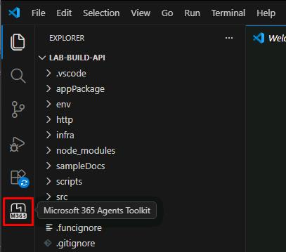
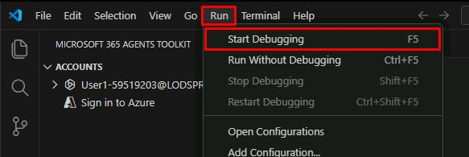

## Task 01: Run the application

### Description

You'll open the Trey Research project in Visual Studio Code, sign in to the Microsoft 365 Agents Toolkit, and start the debugger to run the Azure Functions API locally.

### Success criteria

- You signed in to your Microsoft 365 account through the Agents Toolkit.
- The debugger started successfully and Microsoft Edge opened a sign-in window.
- You minimized Edge without signing in, leaving the debugger running.

### Key steps

---
1. Sign in to the lab VM with the following credentials:

	| Item     | Value                                                |
	|:---------|:---------|
	| Username | **@lab.VirtualMachine(Windows11(25H2)).Username**       |
	| Password | **+++@lab.VirtualMachine(Windows11(25H2)).Password+++** |

1. Open **Visual Studio Code**.

    {: .note }
    > This will open a project folder with a declarative agent located in `C:\Lab Files\lab-build-api`.

1. In the leftmost pane, select the **Microsoft 365 Agents Toolkit** icon.

    

1. In the **MICROSOFT 365 AGENTS TOOLKIT** pane, under the **ACCOUNTS** section, select **Sign in to Microsoft 365**.

1. In the dialog, select **Sign in**.

1. In the **Windows Security** dialog, select **Allow**.

1. Sign in with your lab credentials:

    | Item | Value |
    |:---------|:---------|
    | Username | `@lab.CloudPortalCredential(User1).Username` |
    | Password | `@lab.CloudPortalCredential(User1).AccessToken` |

1. Close the browser to return to Visual Studio Code.

1. In the top menu bar, select **Run**, then **Start Debugging**.

    

    {: .warning }
    > This may take a couple minutes to start.

1. In the **Windows Security** dialog, select **Allow**.

    {: .note }
    > Once started, Microsoft Edge will open a sign in window.

1. Minimize Microsoft Edge without signing in.
    
    {: .warning }
    > Do not close the window as that will stop the debugger.