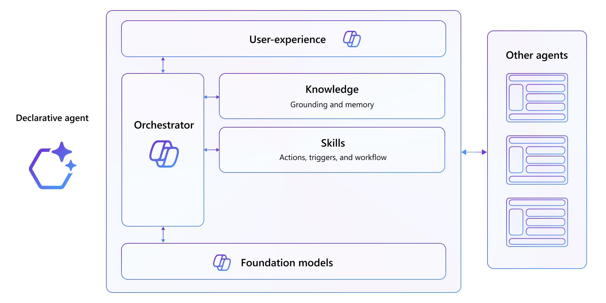

# TechLab MCP Server integration and connected agents

## Introduction
Declarative agents are a type of agent for Microsoft 365. You can build one by extending Microsoft 365 Copilot. You define custom knowledge and custom actions to create agents tailored to a specific scenario.

Declarative agents use the same infrastructure, orchestrator, foundation model, and security controls as Microsoft 365 Copilot, which ensures a consistent and familiar user experience.

## Objectives

After completing this lab, you'll be able to:

- Run and test an Azure Functions-based REST API locally using the Azurite storage emulator.
- Verify API behaviour using HTTP test requests in VS Code.
- Create a declarative agent backed by an API plugin and SharePoint knowledge.
- Configure a declarative agent manifest with instructions, conversation starters, and capabilities.
- Extend an existing API with new resource paths and register them in the application package.
- Update the OpenAPI Specification and plugin definition files to expose new functions to Copilot.
- Integrate a Microsoft 365 Copilot Connector as a knowledge capability in a declarative agent.

## Duration

**Estimated time**: 120 minutes

### Declarative agent architecture diagram 

At the very basis is the foundational model of Microsoft 365 Copilot, as well as the same orchestrator. The agent provides custom knowledge, grounding data, and custom skills as actions, triggers, and workflows.
