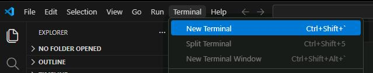
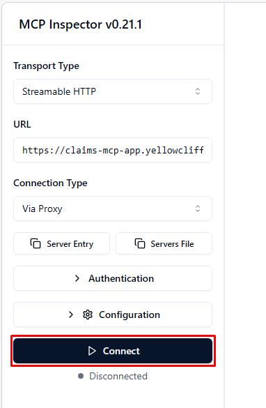
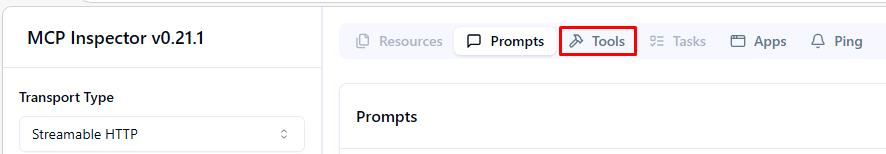
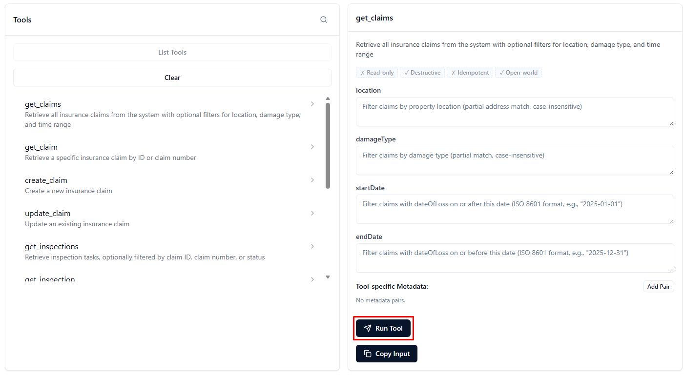
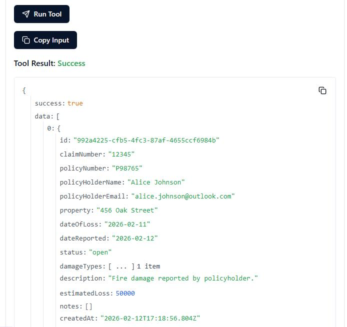

## Task 01: Test the hosted MCP Server

### Description
Before building your agent, you'll verify that Zava's hosted MCP server is reachable and functioning correctly. You'll use the MCP Inspector - a browser-based testing tool - to connect to the server, list its available tools, and run a sample query against live claims data.

### Success criteria
- You successfully launched the MCP Inspector and connected to the hosted MCP server.
- You listed all 15 available tools across the Claims, Inspections, Contractors, and Purchase Orders resource groups.
- You ran the `get_claims` tool and received a valid JSON response containing at least one claim record.

### Key steps

---

#### 01: Launch MCP Inspector

1. Open Visual Studio Code.

1. On the upper bar, select **Terminal**, then **New Terminal**.

	

1. Run the following command:

    ```
    npx @modelcontextprotocol/inspector --transport http --server-url https://claims-mcp-app.yellowcliff-c66c6908.eastus.azurecontainerapps.io/mcp/messages
    ```

1. Enter `y` to proceed with any installation. 

    {: .note }
    > This opens a web interface to test the MCP server.

---

#### 02: Explore available tools

1. In the MCP Inspector's leftmost pane, select **Connect**.

	

1. On the top bar, select **Tools**.

	

1. Select **List Tools** to get the list of tools exposed by the MCP server.

    You'll find 15 tools:

    | Resource | Available Tools |
    |----------|---------------------|
    | **Claims** | get_claims, get_claim, create_claim, update_claim, delete_claim |
    | **Inspections** | get_inspections, get_inspection, create_inspection, update_inspection |
    | **Contractors** | get_contractors, get_inspectors |
    | **Purchase Orders** | get_purchase_orders, create_purchase_order, update_purchase_order, delete_purchase_order |

---

#### 03: Test get claims tool

1. Select the **get_claims** tool from the list.

1. On the lower side of the **get_claims** pane, select **Run Tool**.

	

1. Scroll down in the pane to verify you receive JSON response with claims data (for example, claim CN202504990 for John Smith).

    

1. Close the browser.