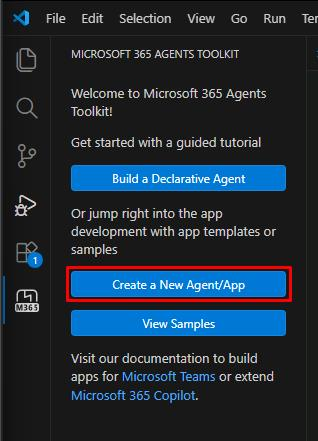
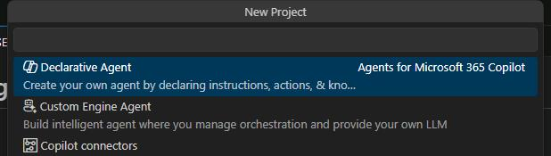
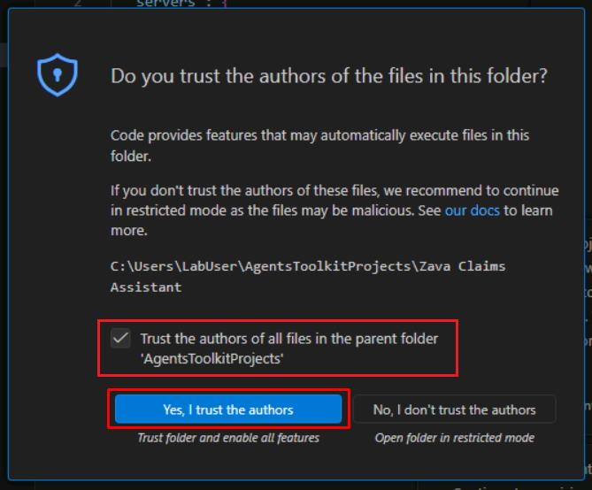
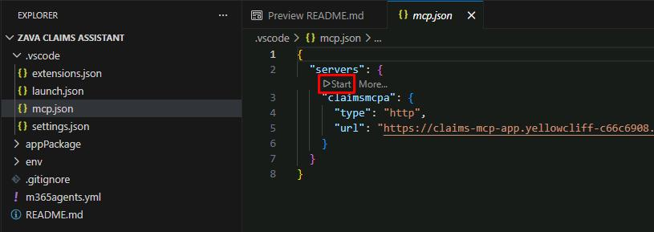
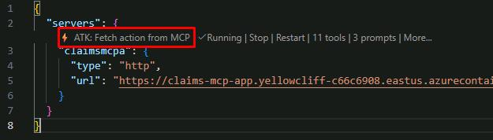
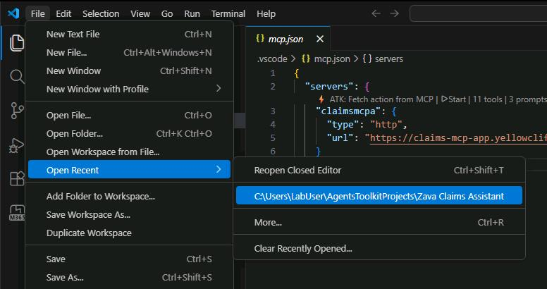
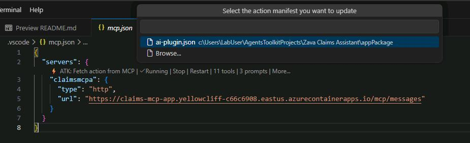
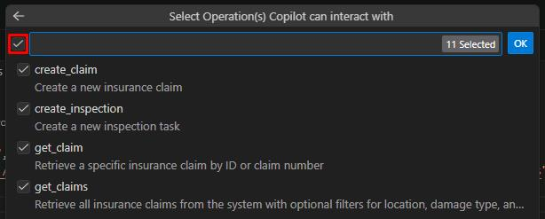

## Task 02: Create a new declarative agent project

### Description
You'll use the Microsoft 365 Agents Toolkit to scaffold a new declarative agent project, connect it to Zava's MCP server, and select the tools the agent will have access to. By the end of this task you'll have a working project structure with an action manifest pre-populated from the live MCP server.

### Success criteria
- You created a new **Declarative Agent** project named `Zava Claims Assistant` using the Microsoft 365 Agents Toolkit.
- You connected the project to the hosted MCP server URL and fetched its tools.
- You selected all 15 available tools and confirmed that `appPackage/ai-plugin.json` was populated with the correct functions and server URL.

### Key steps

---

#### 01: Create new agent using Microsoft 365 Agents Toolkit

1. Go back to Visual Studio Code.

1. In the leftmost pane, select the **Microsoft 365 Agents Toolkit** () icon.

1. In the Agents Toolkit pane, select **Create a New Agent/App**.

	

1. Select **Declarative Agent** from the template options.

	

1. Select **Add an Action**.

1. Select **Start with an MCP server (preview)**.

1. Enter the following publicly accessible MCP Server URL: 

	```
    https://claims-mcp-app.yellowcliff-c66c6908.eastus.azurecontainerapps.io/mcp/messages
    ```

1. Choose the **Default folder** to scaffold the agent.

1. Enter the following **application name**: 

	`Zava Claims Assistant`

    {: .note }
    > You'll be directed to the newly created project which should have the file `.vscode/mcp.json` open. If the file does not open automatically, you can open it manually. This is the MCP server configuration file for VS Code to use.

1. Select the checkbox for **Trust the authors...**, then select **Yes, I trust the authors**.

	

	{: .note }
    > After a few moments, it should load **.vscode\mcp.json**.

3. In **mcp.json**, below **"servers"**, select the **Start** button to fetch tools from your server.

	

	{: .note }
    > Once started, you'll see the number of tools and prompts available. 

1. Select **ATK:Fetch action from MCP** in the code, to select tools you want to add to the agent. 

	

    {: .warning }
    > If you do not see the option **ATK:Fetch action from MCP**:
    >
    >1. Close the VS Code window.
    >
    >1. Relaunch the app by selecting **File**, then **Open recent**, and then **C:\Users\LabUser\AgentsToolkitProjects\Zava Claims Assistant**.
    >
    >   
    >
    >1. Select **Start** again.
    >
    >1. Select **ATK:Fetch action from MCP**.

1. Select **ai-plugin.json**.

	

1. Select all the available tools.
    
    

1. Select **OK**.

	{: .note }
    > This step will populate the action manifest **ai-plugin.json** with the required functions, MCP server URL, etc., which are needed for actions in an agent.

---

#### 02: Understand the action manifest update from previous step

- In **appPackage/ai-plugin.json**, examine the structure with your chosen tools and MCP server url pre-populated:

    ```json
    {
        "$schema": "https://aka.ms/json-schemas/copilot-extensions/v2.1/plugin.schema.json",
        "schema_version": "v2.4",
        "name_for_human": "Zava Claims Assistant",
        "description_for_human": "Zava Claims Assistant${{APP_NAME_SUFFIX}}",
        "contact_email": "publisher-email@example.com",
        "namespace": "zavaclaimsassistant",
        "functions": [
            {
                "name": "create_claim",
                "description": "Create a new insurance claim",
                "parameters": {
                    ...
    }
    ```

---

{: .note }
> You now have a basic declarative agent that is connected to your MCP Server with tools ready for use.