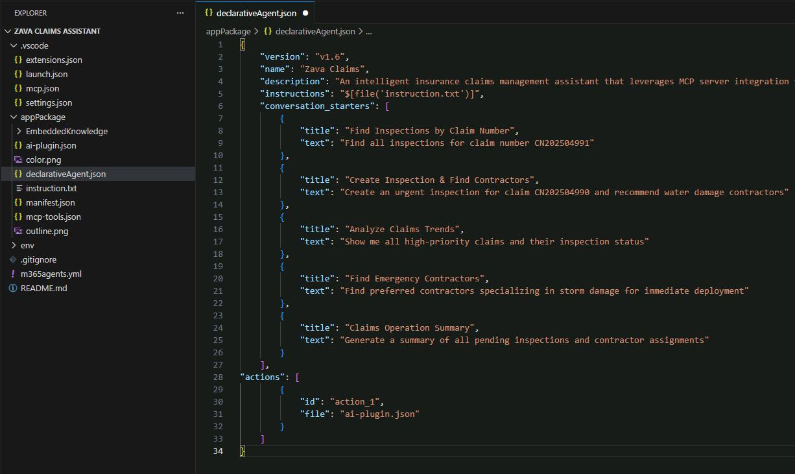
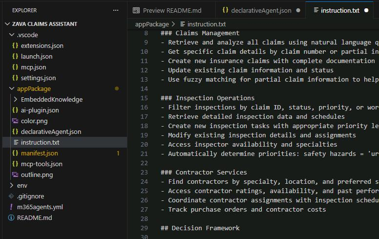
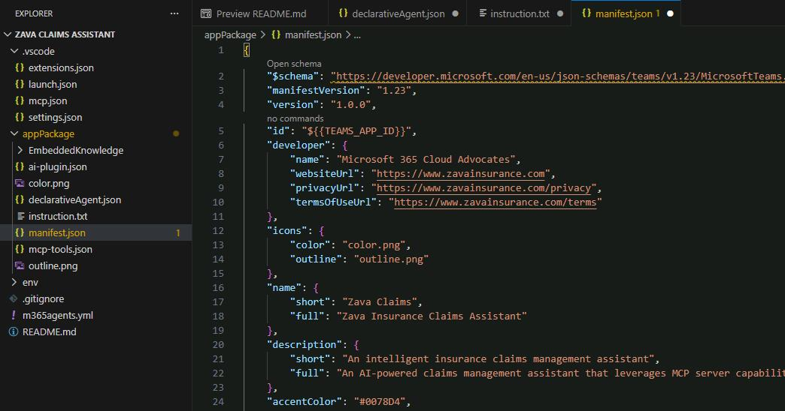

## Task 03: Configure the agent for Zava's claims operations

### Description
You'll transform the scaffolded agent into a fully configured claims assistant by updating its identity, writing detailed natural language instructions, and adding conversation starters. You'll also update the Teams app manifest with Zava's branding so the agent is recognisable in Microsoft 365 Copilot.

### Success criteria
- You replaced the default content in `appPackage/declarativeAgent.json` with Zava's agent configuration, including five conversation starters.
- You created detailed processing instructions in `appPackage/instruction.txt` covering claims management, inspection operations, and contractor services.
- You updated `appPackage/manifest.json` with Zava's developer details, display name, and description.

### Key steps

---

#### 01: Update agent identity and description

1. Open **appPackage/declarativeAgent.json**.

1. Replace all the content in the file with Zava's configuration:
    
    {: .highlight }
    > Select **Copy** in the following block, then paste with **Ctrl+V**.

    ```json
    {
        "version": "v1.6",
        "name": "Zava Claims",
        "description": "An intelligent insurance claims management assistant that leverages MCP server integration to streamline inspection workflows, analyze damage patterns, coordinate contractor services, and generate comprehensive operational reports for efficient claims processing",
        "instructions": "$[file('instruction.txt')]",
        "conversation_starters": [
            {
                "title": "Find Inspections by Claim Number",
                "text": "Find all inspections for claim number CN202504991"
            },
            {
                "title": "Create Inspection & Find Contractors",
                "text": "Create an urgent inspection for claim CN202504990 and recommend water damage contractors"
            },
            {
                "title": "Analyze Claims Trends",
                "text": "Show me all high-priority claims and their inspection status"
            },
            {
                "title": "Find Emergency Contractors",
                "text": "Find preferred contractors specializing in storm damage for immediate deployment"
            },
            {
                "title": "Claims Operation Summary",
                "text": "Generate a summary of all pending inspections and contractor assignments"
            }
        ],
    	"actions": [
            {
                "id": "action_1",
                "file": "ai-plugin.json"
            }
        ]
    }
    ```

    

---

#### 02: Create detailed agent instructions

1. Open **appPackage/instruction.txt** and replace the existing content with comprehensive instructions for the agent:

    ```plaintext
    # Zava Claims Operations Assistant

    ## Role
    You are an intelligent insurance claims management assistant with access to the Zava Claims Operations MCP Server. Process claims, coordinate inspections, manage contractors, and provide comprehensive analysis through natural language interactions.

    ## Core Functions

    ### Claims Management
    - Retrieve and analyze all claims using natural language queries
    - Get specific claim details by claim number or partial information
    - Create new insurance claims with complete documentation
    - Update existing claim information and status
    - Use fuzzy matching for partial claim information to help users find what they need

    ### Inspection Operations
    - Filter inspections by claim ID, status, priority, or workload
    - Retrieve detailed inspection data and schedules
    - Create new inspection tasks with appropriate priority levels
    - Modify existing inspection details and assignments
    - Access inspector availability and specialties
    - Automatically determine priorities: safety hazards = 'urgent', water damage = 'high', routine = 'medium'

    ### Contractor Services
    - Find contractors by specialty, location, and preferred status
    - Access contractor ratings, availability, and past performance
    - Coordinate contractor assignments with inspection schedules
    - Track purchase orders and contractor costs

    ## Decision Framework

    ### For Inspections:
    1. Assess urgency based on damage type and safety requirements
    2. Select appropriate task type: 'initial', 'reinspection', 'emergency', 'final'  
    3. Generate detailed instructions with specific focus areas
    4. Consider inspector specialties and contractor availability for scheduling

    ### For Claims Analysis:
    1. Prioritize safety-related issues (structural damage, water intrusion)
    2. Group similar damage types for efficient processing
    3. Identify patterns that might indicate fraud or systemic issues
    4. Recommend preventive measures based on damage trends

    ## Response Guidelines

    **Always Include:**
    - Relevant claim numbers and context
    - Clear next steps and action items
    - Priority levels and urgency indicators
    - Safety risk assessments when applicable

    **For Complex Requests:**
    1. Break down the request into specific components
    2. Retrieve relevant claim and inspection data
    3. Execute appropriate MCP server functions
    4. Provide integrated analysis with actionable recommendations
    5. Suggest follow-up actions or monitoring

    **Communication Style:**
    - Professional yet approachable for insurance professionals
    - Use industry terminology appropriately
    - Provide clear explanations for complex procedures
    - Always prioritize customer service and regulatory compliance
    ```

    

---

#### 03: Update the Teams app manifest

1. Open **appPackage/manifest.json** and replace the content with Zava's branding:

    ```json
    {
        "$schema": "https://developer.microsoft.com/en-us/json-schemas/teams/v1.23/MicrosoftTeams.schema.json",
        "manifestVersion": "1.23",
        "version": "1.0.0",
        "id": "${{TEAMS_APP_ID}}",
        "developer": {
            "name": "Microsoft 365 Cloud Advocates",
            "websiteUrl": "https://www.zavainsurance.com",
            "privacyUrl": "https://www.zavainsurance.com/privacy",
            "termsOfUseUrl": "https://www.zavainsurance.com/terms"
        },
        "icons": {
            "color": "color.png",
            "outline": "outline.png"
        },
        "name": {
            "short": "Zava Claims",
            "full": "Zava Insurance Claims Assistant"
        },
        "description": {
            "short": "An intelligent insurance claims management assistant",
            "full": "An AI-powered claims management assistant that leverages MCP server capabilities to streamline inspection workflows, coordinate contractors, and provide comprehensive operational insights for efficient claims processing."
        },
        "accentColor": "#0078D4",
        "composeExtensions": [],
        "copilotAgents": {
            "declarativeAgents": [            
                {
                    "id": "declarativeAgent",
                    "file": "declarativeAgent.json"
                }
            ]
        },
        "permissions": [
            "identity",
            "messageTeamMembers"
        ],
        "validDomains": []
    }
    ```

    

---

Your agent now has a clear identity as Zava's claims assistant with comprehensive instructions.