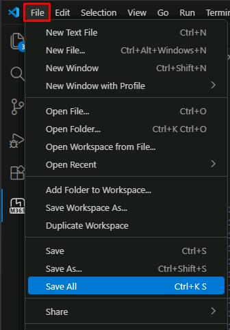
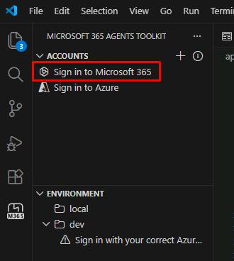
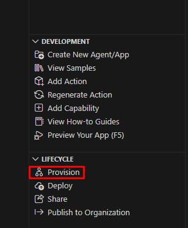
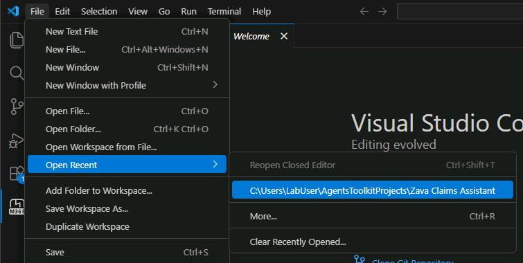
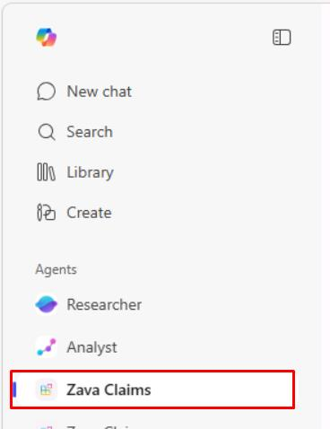
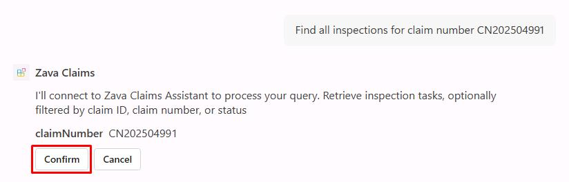
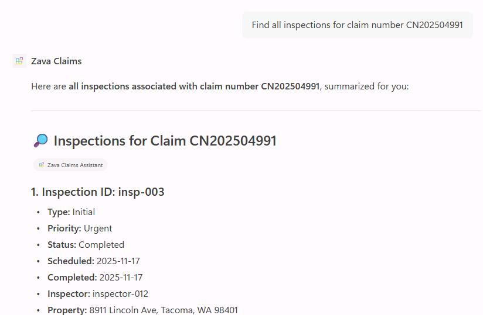
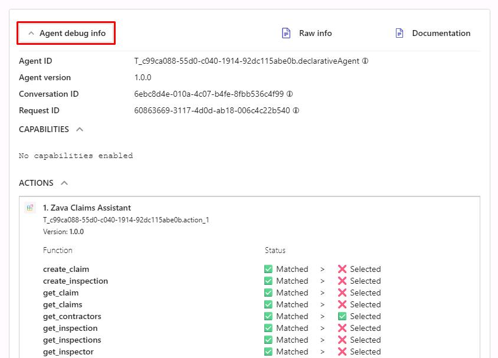

## Task 04: Test the agent integration

### Description
You'll provision the agent package to your Microsoft 365 tenant and then test it inside Microsoft 365 Copilot Chat using natural language prompts. You'll also enable developer debug mode to inspect how the agent routes requests to the MCP server.

### Success criteria
- You provisioned the `Zava Claims Assistant` agent package to your Microsoft 365 tenant without errors.
- You opened the **Zava Claims** agent in Copilot Chat and received a valid response to at least one conversation starter.
- You tested three natural language queries - inspections lookup, inspection creation, and new claim creation - and received correct responses from the MCP server.
- You enabled developer debug mode and reviewed the **Agent debug info** panel for at least one query.

### Key steps

---

#### 01: Provision the agent

You'll need to sign into the Microsoft 365 Agents Toolkit to upload and test your agent from within it.

1. Save your file changes by selecting **File**, then **Save All**.

	

1. In the leftmost pane, select the **Microsoft 365 Agents Toolkit** () icon. 

1. Under the **ACCOUNTS** section, select **Sign in to Microsoft 365**. 

	

1. In the dialog, select **Sign in**.

1. Sign in to the Microsoft 365 tenant using your lab credentials:

    | Item | Value |
    |:---------|:---------|
    | Username | `@lab.CloudPortalCredential(User1).Username` |
    | Password | `@lab.CloudPortalCredential(User1).AccessToken` |

1. Once signed in, close the browser to go back to the project window.

1. Under the **LIFECYCLE** section, select **Provision**.

	

1. Wait for provisioning to complete.

	{: .note }
    > This creates and uploads the agent package.

    {: .warning }
    > If you receive a timeout error during provisioning, try closing and reopening the project, then provision again.
    >
    > **File** > **Open Recent** > **...\Zava Claims Assistant**
    >
    > 

---

#### 02: Test in Microsoft 365 Copilot

1. Open Microsoft Edge, then go to `m365.cloud.microsoft/chat` to open Copilot Chat.

1. Sign in with your lab user credentials:

    | Item | Value |
    |:---------|:---------|
    | Username | `@lab.CloudPortalCredential(User1).Username` |
    | Password | `@lab.CloudPortalCredential(User1).AccessToken` |

1. Close any dialogs.

1. In the leftmost pane, under **Agents**, select **Zava Claims**.  

	

1. Try a conversation starter, type this prompt:
   
   ```
   Find all inspections for claim number CN202504991
   ```
   
1. Select **Confirm** whenever prompted.

	

    

1. Try these natural language queries to test the agent's capabilities:

    - ```
      What claims do we have for storm damage?
      ```

    - ```
      Create a new urgent inspection for claim CN202504990 to assess water damage in the basement
      ```

    - ```
      Create a new claim for Alice Johnson at 456 Oak Street with fire damage from yesterday
      ```

	{: .note }
    > Your agent should successfully respond to natural language queries and interact with the MCP server data.

---

#### 03: Debug the agent 

1. In the chat with the **Zava Claims** agent, send the following prompt:

	```
    -developer on
    ```

	{: .important }
    > This will enable debugging of these conversations.

1. Refresh the browser session (**CTRL+F5**).

1. Select the **Zava Claims** agent again.

1. Continue testing the agent with queries:

	```
    Find contractors who specialize in roofing and are marked as preferred
    ```

1. On the lower side of the agent response, select **Agent debug info**.

    

---

### **Congratulations!** 
You've successfully completed this exercise. You've successfully created and deployed the Zava Insurance's declarative agent that seamlessly integrates with their MCP server. 