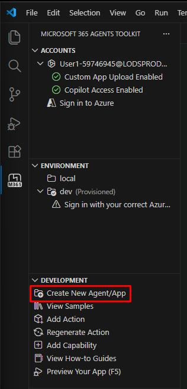

## Task 01: Create a new declarative agent for embedded knowledge


### Description
You'll create a second declarative agent project - Zava Procurement - that does not call an external API. Instead, it uses the **EmbeddedKnowledge** capability to bundle static PDF files directly into the agent package. This gives the agent instant, offline access to Zava's contractor pricing sheets and claims inspection guidelines.

### Success criteria
- You created a new **Declarative Agent** project named `Zava Procurement` with no action using the Microsoft 365 Agents Toolkit.
- The new project opened in a separate VS Code window and contains the `appPackage/EmbeddedKnowledge` folder.

### Key steps

---

#### 01: Create new agent using Microsoft 365 Agents Toolkit

1. Go back to VS Code.

1. In the **Microsoft 365 Agents Toolkit** pane, under **DEVELOPMENT**, select **Create New Agent/App**.

	

1. Select **Declarative Agent** from the template options.

1. Select **No Action** from the options.

1. Select **Default folder**.

1. Enter the application name: 

	```
    Zava Procurement
    ```

	{: .note }
    > This will create a new agent and open a new project window in VS Code.

---

#### 02: Understand how to embed files 

Navigate to the **appPackage** folder and explore its contents. You'll recognize familiar files from your previous declarative agent work: the **manifest.json** file (which defines your agent's capabilities) and the **declarativeAgent.json** file (which configures your agent's behavior).

The key addition you'll notice is the **EmbeddedKnowledge** folder. This is where you'll store Zava's contractor pricing data files that will be embedded directly into your agent, enabling instant access to pricing intelligence without requiring live database queries.

{: .note }
> Sample PDF files without sensitivity labels are provided for testing purposes. If you choose to test with your own files-especially Office documents, ensure they comply with the sensitivity labels configured in your tenant.