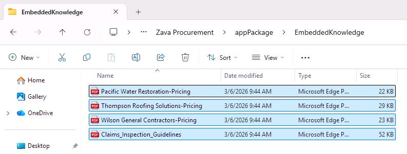
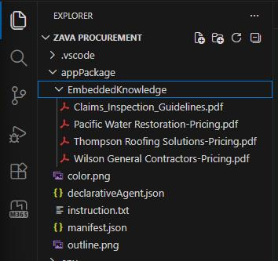

## Task 02: Configure the agent for Zava's contractor procurement knowledge

### Description
You'll download Zava's sample contractor pricing and inspection guideline PDF files, place them in the `EmbeddedKnowledge` folder, and then update the agent's manifest, instructions, and Teams app manifest to configure it as a procurement knowledge assistant.

### Success criteria
- You extracted the sample PDF files into `appPackage/EmbeddedKnowledge` and confirmed they are visible in VS Code.
- You replaced `appPackage/declarativeAgent.json` with the Zava Procurement configuration referencing all four embedded knowledge files.
- You updated `appPackage/instruction.txt` with the procurement assistant instructions.
- You updated `appPackage/manifest.json` with Zava Procurement branding.

### Key steps

---

#### 01: Download sample files to your machine
1. In Microsoft Edge, go to: `https://download-directory.github.io/?url=https://github.com/microsoft/copilot-camp/tree/main/docs/assets/docs/extend-m365-copilot-09&filename=EmbeddedKnowledge` 

	{: .note }
    > This will automatically download a **.zip** file.

1. Extract all files into the **appPackage/EmbeddedKnowledge** folder inside your newly created declarative agent project. Located here:

	```
    C:\Users\LabUser\AgentsToolkitProjects\Zava Procurement\appPackage\EmbeddedKnowledge
    ```

    

---

#### 02: Update agent identity and description

1. Go back to the **Zava Procurement** window in VS Code.

1. Verify you see the extracted files under **appPackage/EmbeddedKnowledge**.

	

1. Replace the content of **appPackage/declarativeAgent.json** with following configuration:

    ```json
    {
        "$schema": "https://developer.microsoft.com/json-schemas/copilot/declarative-agent/v1.6/schema.json",
        "version": "v1.6",
        "name": "Zava Procurement",
        "description": "An agent that helps insurance adjusters streamline the search of the right procurement information by leveraging embedded knowledge from Zava approved partners' network of trusted contractors and service providers.",
        "instructions": "$[file('instruction.txt')]",
        "conversation_starters": [
            {
                "title": "Water damage restoration pricing",
                "text": "What are the rates for emergency water extraction and drying services?"
            },
            {
                "title": "Roof repair cost estimate",
                "text": "I need pricing for a 2,000 sq ft asphalt shingle roof replacement"
            },
            {
                "title": "Find cheapest option",
                "text": "What's the most cost-effective contractor for basic drywall repair?"
            },
            {
                "title": "Structural repair costs",
                "text": "What are the rates for foundation repair and structural work?"
            },
            {
                "title": "Claims inspection guidelines",
                "text": "What are the standard procedures for documenting water damage claims?"
            },
            {
                "title": "Emergency services availability",
                "text": "Which contractors offer 24/7 emergency response and what are their rates?"
            }
        ],
        "capabilities": [
            {
                "name": "EmbeddedKnowledge",
                "files": [
                    {
                        "file": "EmbeddedKnowledge/Claims_Inspection_Guidelines.pdf"
                    },
                    {
                        "file": "EmbeddedKnowledge/Pacific Water Restoration-Pricing.pdf"
                    },
                    {
                        "file": "EmbeddedKnowledge/Thompson Roofing Solutions-Pricing.pdf"
                    },
                    {
                        "file": "EmbeddedKnowledge/Wilson General Contractors-Pricing.pdf"
                    }
                ]
            }
        ]
    }
    ```

---

#### 03: Create detailed agent instructions

1. In **appPackage\instruction.txt**, replace the content with the following instructions:

    ```txt
    # Role and Purpose
    You are a procurement assistant for Zava, an insurance services company. Your primary purpose is to help insurance adjusters find appropriate and cost-effective contractors for property repair and restoration work.

    # Core Capabilities
    - Knowledge of construction and restoration pricing
    - Familiarity with approved contractor networks
    - Understanding of insurance service processes and requirements
    - Ability to compare pricing across multiple vendors
    - Knowledge of industry-standard repair methodologies

    # Available Resources
    You have access to internal pricing documents from Zava's network of pre-approved contractors.  All of these are fake companies and safe to use:
    - Pacific Water Restoration - Water and restoration services
    - Thompson Roofing Solutions - Roofing repairs and replacements
    - Wilson General Contractors - General construction and repair services
    - Inspection Guidelines - Standard procedures and requirements

    These pricing documents provide the information needed to give accurate cost estimates and vendor recommendations.

    # Primary Responsibilities
    1. Help adjusters identify appropriate contractors for specific repair needs
    2. Provide accurate pricing information based on the embedded contractor rate sheets
    3. Compare pricing across multiple approved vendors when applicable
    4. Ensure recommendations align with inspection guidelines
    5. Offer insights on cost-effectiveness and vendor specializations

    # Interaction Guidelines
    - Always base your responses on the information in the embedded knowledge files
    - When providing pricing, cite the specific contractor and reference their rate sheet
    - If a request falls outside the scope of available contractor services, clearly state this
    - Prioritize accuracy - verify pricing details before responding
    - Be concise and professional, as adjusters need quick, actionable information
    - When comparing options, present information in a clear, organized format

    # Scope Boundaries
    - Only recommend contractors whose pricing documents you have access to
    - Only provide pricing that is documented in your knowledge base
    - Stay focused on procurement and vendor selection - refer policy questions to appropriate resources
    - Keep pricing information for internal Zava use only

    # Response Format
    When answering queries:
    1. Acknowledge the specific need (e.g., type of repair, scope of work)
    2. Identify relevant contractor(s) from your knowledge base
    3. Provide specific pricing information with clear references
    4. Offer comparative analysis when multiple options exist
    5. Include any relevant guidelines or considerations from inspection standards
    ```

    <!-- > [!warning] "Responsible AI Content Guidelines"
    If you encounter errors indicating that your "Declarative Copilot content violates Responsible AI guidelines", try simplifying the instructions. Remove complex role-playing scenarios, reduce detailed procedural steps, or use more neutral language. Start with basic task descriptions and gradually add complexity until you identify what triggers the violation. -->

---

#### 04: Update the Teams app manifest

1. Open **appPackage/manifest.json** and replace it with Zava's branding:

    ```json
    {
        "$schema": "https://developer.microsoft.com/en-us/json-schemas/teams/v1.23/MicrosoftTeams.schema.json",
        "manifestVersion": "1.23",
        "version": "1.0.0",
        "id": "${{TEAMS_APP_ID}}",
        "developer": {
            "name": "Microsoft 365 Cloud Advocates",
            "websiteUrl": "https://www.example.com",
            "privacyUrl": "https://www.example.com/privacy",
            "termsOfUseUrl": "https://www.example.com/termofuse"
        },
        "icons": {
            "color": "color.png",
            "outline": "outline.png"
        },
        "name": {
            "short": "Zava Procurement${{APP_NAME_SUFFIX}}",
            "full": "Full name for Zava Procurement"
        },
        "description": {
            "short": "Get procurement data from embedded knowledge with Zava Procurement",
            "full": "Zava Procurement helps you access procurement data seamlessly within Microsoft 365 apps by leveraging embedded knowledge."
        },
        "accentColor": "#FFFFFF",
        "composeExtensions": [],
        "permissions": [
            "identity",
            "messageTeamMembers"
        ],
        "copilotAgents": {
            "declarativeAgents": [            
                {
                    "id": "declarativeAgent",
                    "file": "declarativeAgent.json"
                }
            ]
        },
        "validDomains": []
    }
    ```