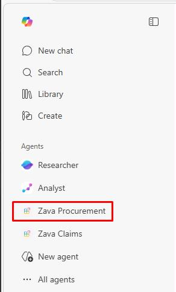

## Task 03: Test the agent integration

### Description
You'll provision the Zava Procurement agent and verify it can answer pricing and guideline questions by drawing exclusively on its embedded knowledge files - without making any live API calls.

### Success criteria
- You provisioned the `Zava Procurement` agent package to your Microsoft 365 tenant without errors.
- You opened the **Zava Procurement** agent in Copilot Chat and received pricing information sourced from the embedded PDF files.
- You confirmed the agent answered at least two conversation starters using data from the embedded knowledge files.


### Key steps

---

#### 01: Provision the agent

1. Save your file changes by selecting **File**, then **Save All**.

1. Open the **Microsoft 365 Agents Toolkit** pane.

1. Under the **LIFECYCLE** section, select **Provision**.

1. Select the **dev** environment.

1. Wait for provisioning to complete.

---

#### 02: Test in Microsoft 365 Copilot

1. Open Microsoft Edge and go back to `m365.cloud.microsoft/chat`.

1. In the leftmost pane, under **Agents**, select **Zava Procurement**.

	

1. Try some conversation starters:

   ```
   What are the rates for emergency water extraction and drying services?
   ```

   ```
   Which contractors offer 24/7 emergency response and what are their rates?
   ```

    
