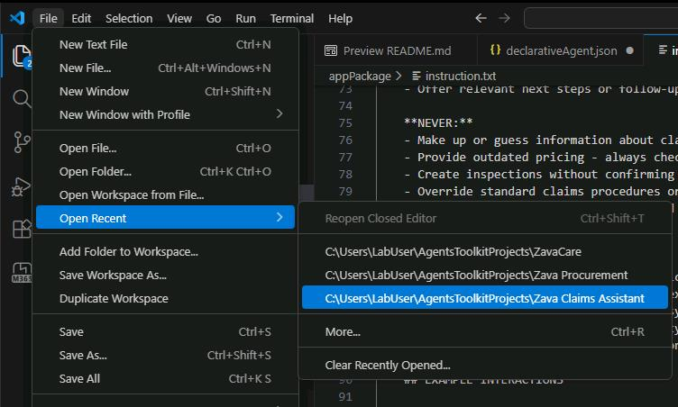
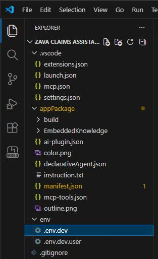
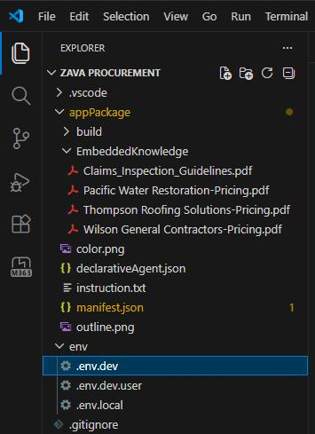
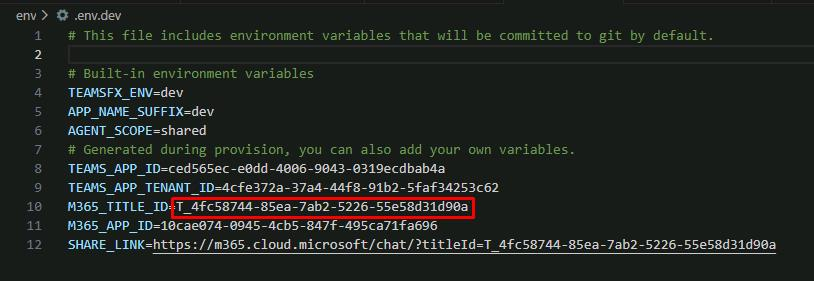
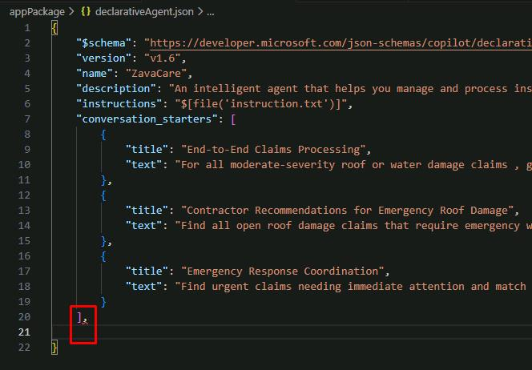
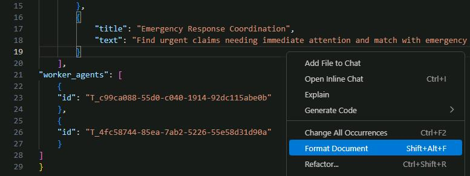
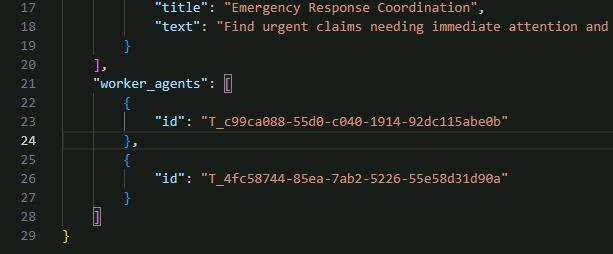

## Task 05: Configure connected agent capabilities

### Description
To enable orchestration, you need to link Zava Care to its two worker agents using their Microsoft 365 Title IDs. You'll retrieve these IDs from each agent's environment file and add a `worker_agents` block to the Zava Care declarative agent manifest.

### Success criteria
- You retrieved the `M365_TITLE_ID` values from the `env/.env.dev` files for both the Zava Claims Assistant and Zava Procurement projects.
- You added a correctly formatted `worker_agents` block to `appPackage/declarativeAgent.json` in the Zava Care project referencing both IDs.
- The file is valid JSON with no formatting errors after running **Format Document**.

### Key steps

---

#### 01: Get the Zava Claims agent ID

1. Swap to your **Zava Claims Assistant** VS Code project window. 

	{: .note }
    > Or reopen by selecting **File** > **Open Recent** > **...\Zava Claims Assistant**
    >
	> 

1. Open the **env/.env.dev** file.

	

1. Copy the value of **M365_TITLE_ID** and paste it in the text box below.

    **Claims Agent ID**<br>@lab.TextBox(ClaimsAgentID)

    

    {: .warning }
    > The pasted value will be used for reference in a future step.

---

#### 02: Get the Zava Procurement agent ID

1. Swap to your **Zava Procurement** VS Code window. 

	{: .note }
    > Or reopen by selecting **File** > **Open Recent** > **...\Zava Procurement**

1. Open the **env/.env.dev** file.

	

1. Copy the value of **M365_TITLE_ID** and paste it in the text box below.

    **Procurement Agent ID**<br>@lab.TextBox(ProcurementAgentID)

    


---

#### 03: Connect the agents

1. Swap to your **Zava Care** orchestrator's VS Code project window. 

1. Open file **appPackage/declarativeAgent.json**

1. Locate the end of the **conversation_starters** array on line 20.

1. Add a comma (`,`) after the closing bracket of **conversation_starters**, then create a new line.

	

1. Paste the following code in the new line:

    ```json
    "worker_agents": [
        {
        "id": "@lab.Variable(ClaimsAgentID)"
        },
        {
        "id": "@lab.Variable(ProcurementAgentID)"
        }
    ]
    ```

    {: .warning } This uses the values for **M365_TITLE_ID** pasted in the text boxes in the previous steps.

1. Right-click anywhere in the file, then select **Format Document** to fix the spacing.

	
    

1. Save your file changes by selecting **File**, then **Save All**.

---

Your orchestrator agent is now connected to both specialized agents!