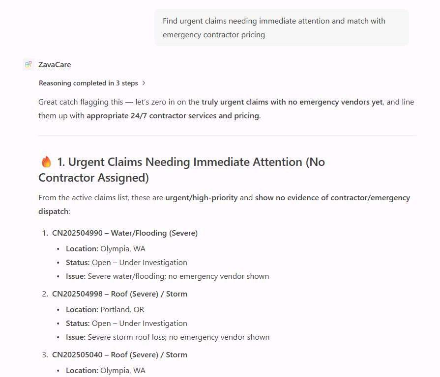

## Task 06: Test connected agent orchestration

### Description
You'll provision the Zava Care orchestrator agent and verify that it correctly delegates tasks to its two worker agents - retrieving live claims data from Zava Claims and current pricing from Zava Procurement - to produce a unified response to a complex, multi-step query.

### Success criteria
- You provisioned the `Zava Care` agent package to your Microsoft 365 tenant without errors.
- You opened the **Zava Care** agent in Copilot Chat and sent the emergency response coordination prompt.
- You confirmed that the agent's response drew on both worker agents - live claims data and embedded pricing information - in a single reply.

### Key steps

---

#### 01: Provision the connected agent

1. In the leftmost pane, select the **Microsoft 365 Agents Toolkit** () icon.

1. Under the **LIFECYCLE** section, select **Provision**.

1. Select the **dev** environment.

1. Wait for provisioning to complete.

---

#### 02: Test multi-agent workflows

1. Open Microsoft Edge, then go back to `m365.cloud.microsoft/chat`

1. In the leftmost pane, under **Agents**, select **Zava Care**.

1. Test the following orchestrated workflow:

    **Complex Workflow : Multi Agent Coordination**  

    ```
    Find urgent claims needing immediate attention and match with emergency contractor pricing
    ```

	{: .note }
    > Notice it uses both agents to generate a response.

1. Select **Confirm** through the prompts.

	

---

**Well done!** You've successfully built Zava Insurance's Connected Agent orchestration system! 

===

## Conclusion

**Congratulations!** You've completed the lab. This achievement represents the culmination of a sophisticated multi-agent architecture that represents the future of enterprise AI systems - specialized, coordinated, and infinitely extensible! 🚀

In this lab you built a complete multi-agent system for Zava Insurance's claims operations. You started by connecting a declarative agent to a live MCP server and verifying its tools with the MCP Inspector. You then configured a fully branded claims assistant with natural language instructions, before creating a second agent that answers pricing questions from embedded PDF knowledge files. Finally, you built an orchestrator agent that coordinates both specialists into a single, unified conversational experience inside Microsoft 365 Copilot Chat.

### Next steps

Take these concepts further with in-depth, hands-on labs in Copilot Developer Camp:
- [Connect Declarative agent to MCP Server](https://microsoft.github.io/copilot-camp/pages/extend-m365-copilot/08-mcp-server/)
- [Connected Agents - Zava's Multi-Agent Claims Orchestration](https://microsoft.github.io/copilot-camp/pages/extend-m365-copilot/09-connected-agent/)

### Resources

- [Declarative agents overview](https://learn.microsoft.com/en-us/microsoft-365-copilot/extensibility/overview-declarative-agent)
- [Copilot Developer Camp](https://aka.ms/copilotdevcamp)
